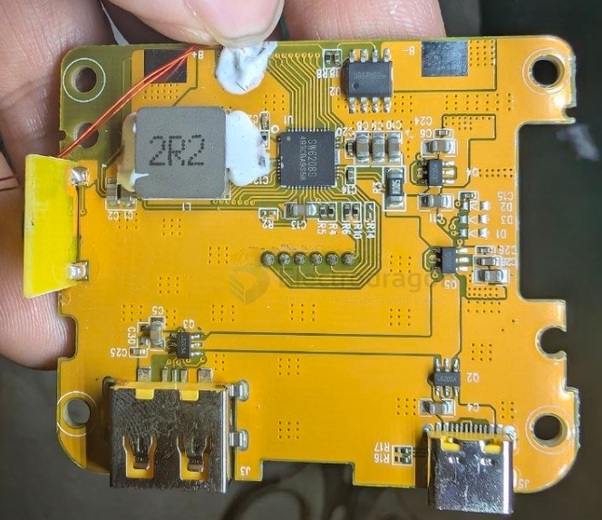
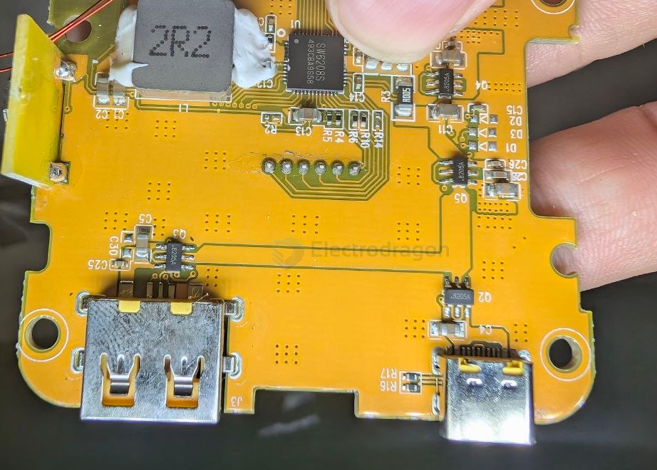
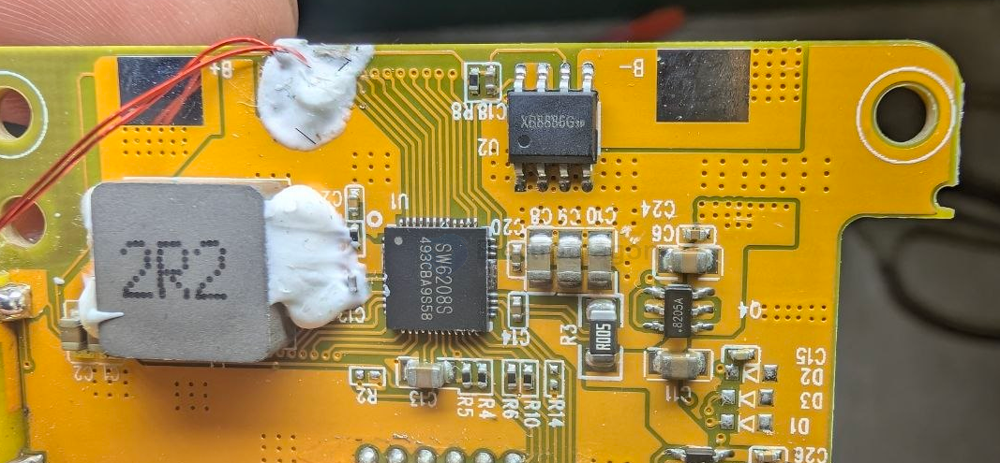

# SW6208-dat

- [[SW6208-dat]] - [[SW6206-dat]] - [[ismartware-dat]] - [[power-bank-dat]]

Total Solution Include PD for Bidirectional Fast Charge Power Bank

The SW6208 is a highly integrated power management IC for fast charge power bank application, and supports A+A+B+C+L five ports. It integrates 5A switching charger, 22.5W synchronous boost, PPS/PD/QC/AFC/FCP/SCP/PE/SFCP  fast  charge  protocol,  fuel  gauge,  segment/led  driver  and power  controller.  With  simple  external  components,  The  SW6208  provides  a  turn-key  high efficiency solution for fast charge battery management.

## build 

- [[8205-dat]] - [[xysemi-dat]]

- [[XB8886-dat]] - [[SW6208-dat]] - [[xysemi-dat]] - [[battery-protector-1s-dat]] - [[battery-protector-dat]]

- [[PCB-form-dat]] - [[PCB-stack-dat]]

## ref 

