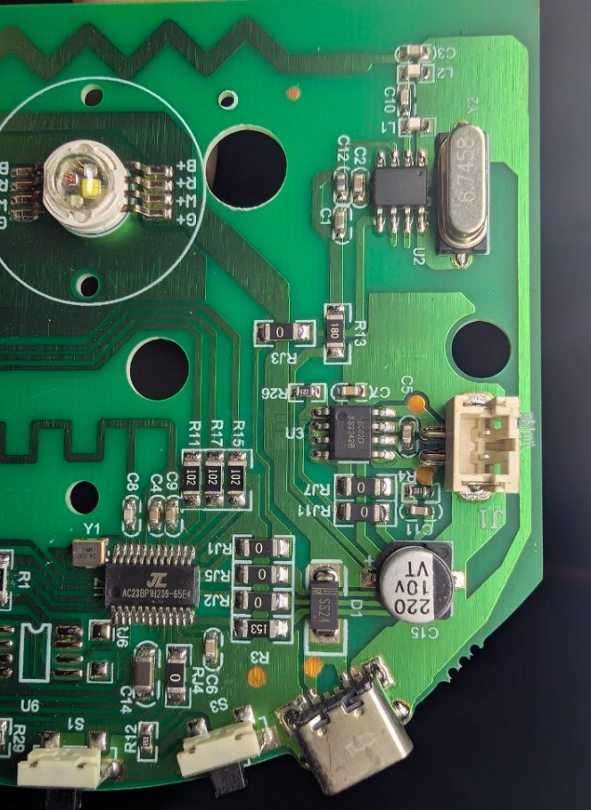
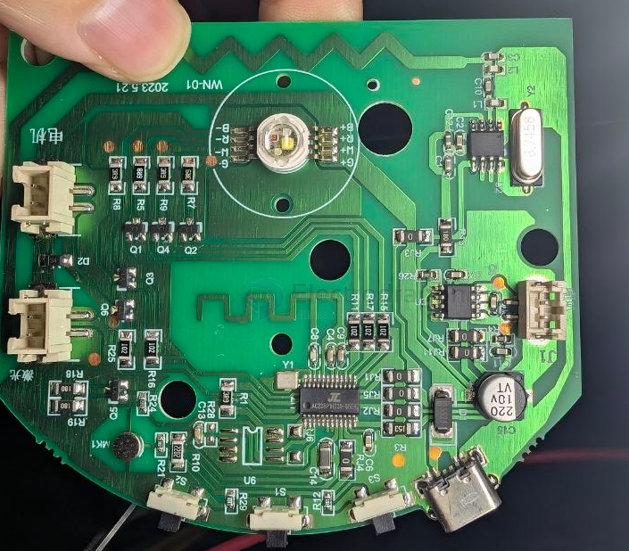
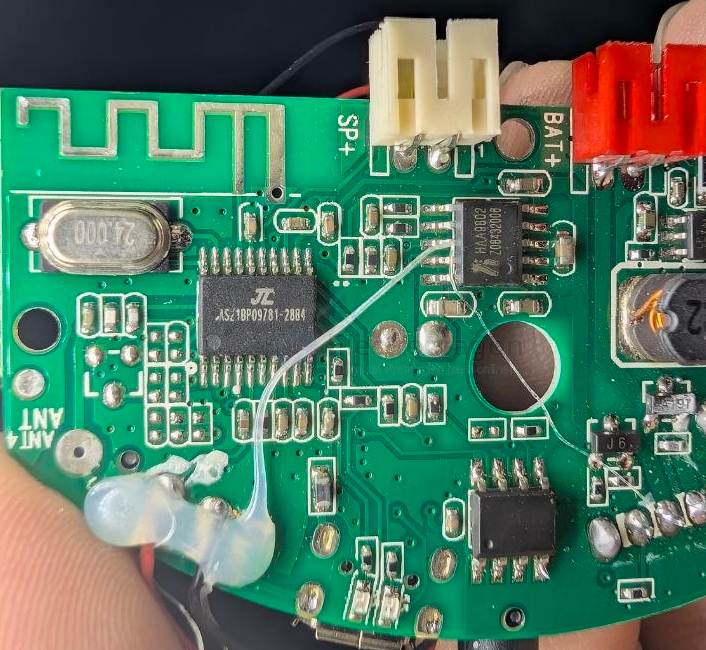
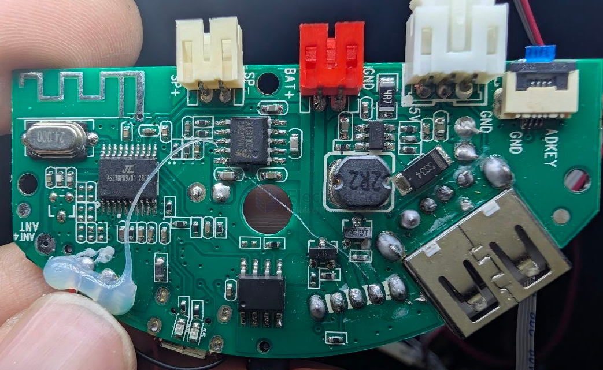
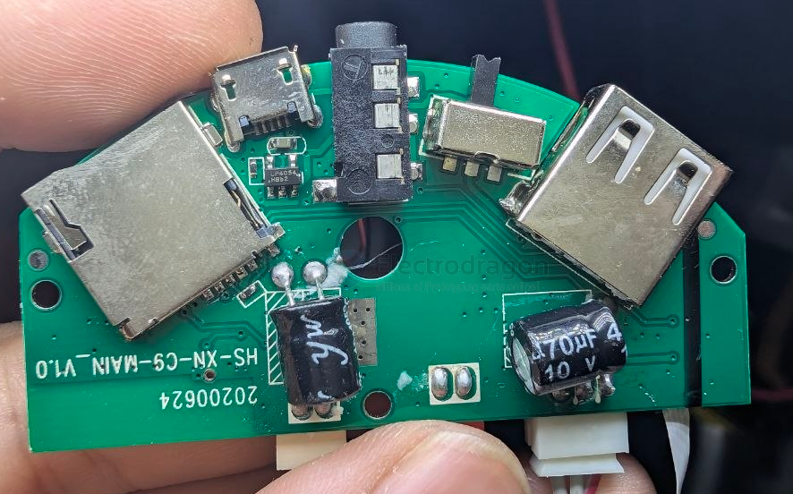
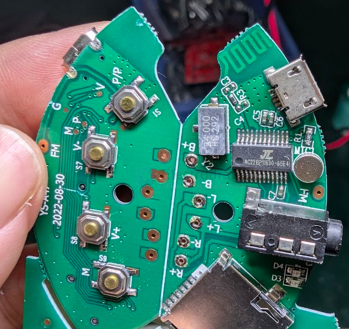

# AC2xBP-dat

- [[jieli-dat]] - [[AC2xBP-dat]]

JL `AS23BP`  NOT AC23BP 

- [[antenna-dat]] - [[antenna-design-dat]] - [[AC2xBP-dat]] - [[jieli-dat]]

- [[amplifier-audio-dat]] - [[8002-dat]]

- [[LED-RGB-dat]] - [[LED-dat]]

JL AC21BP 

- [[HAA9802-dat]] - [[Hynitron-dat]]

JL AC22BP11630 - 

- [[PCB-penalization-dat]] - [[PCB-form-dat]] - [[jieli-dat]]

AC20BP

JL AC22BP == guess AC6925D AC6951C - [[AC69XX-dat]]

## ref 

