# AC69xx-dat

Global TODO: describe all the alt functions too.

- AC6921A 
- AC6926 
- AC6928B 
- AC6925A 
- AC6925B

- AC6951C 
- AC6956D 
- AC6956B 
- AC6956C 
- AC6956F 
- AC6953A 
- AC6952D 
- AC6955F

- AC6965A
- AC6969D
- AC6965E 
- 

- AD6976D
- AD6973D 

- AC6328A
- AC6329C 
- AC6323A

- AC7063M2

- AC8976A8 

- AC7003D4/D8

- JL7016G 

https://device.report/zhuhai-jieli-technology/ble

## AC690N

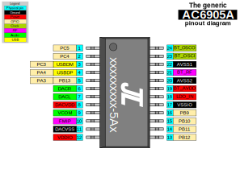

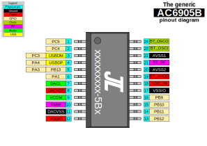

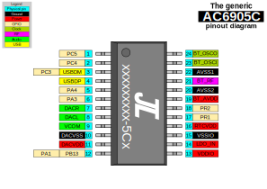

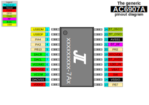

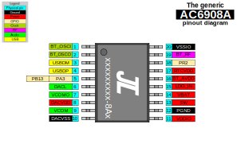

## AC692N

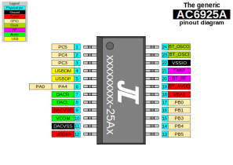

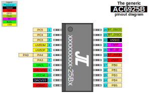

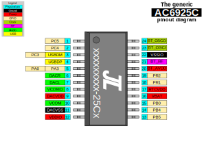

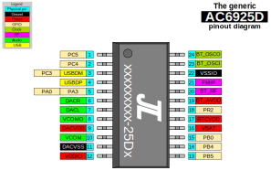

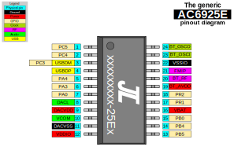

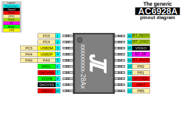

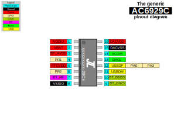

## AC696N

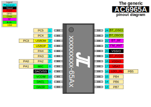

----

## AC109N

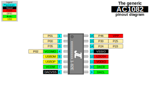

## AC1187

**NOTE** this is merely a guess, don't trust it.

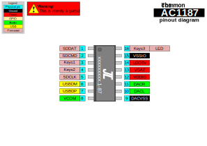
