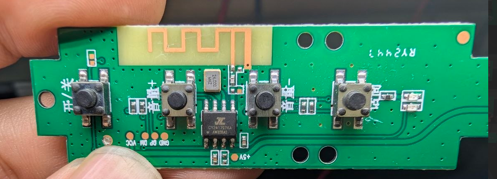
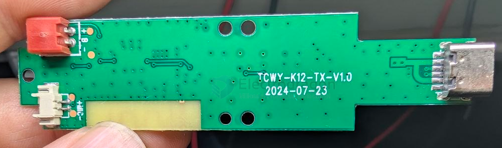

# AW3x8-dat

- [[jieli-dat]] - [[AW3x8-dat]] - [[bluetooth-voice-dat]] - [[bluetooth-dat]]

- datasheet [[AW318A-Datasheet-V1.0.pdf]] - sch [[AW318A-sch.pdf]]

AW318A of the AW31N series of jieli Bluetooth chips is a low-cost ultra-low power Bluetooth data transmission system-level SOC

For smart home, IoT control and other wireless data transmission smart devices

Application scenarios include remote control, selfie stick, vibrato, dual-mode mouse, USB adapter, Bluetooth module, electronic price tag, MCU and other diversified IoT products

## build 

JL 01241791 AW328A2

## ref 

- [[jieli]]

