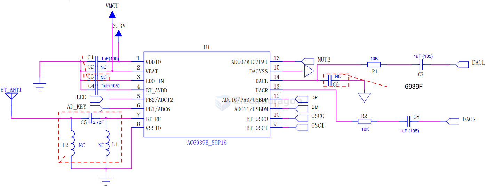
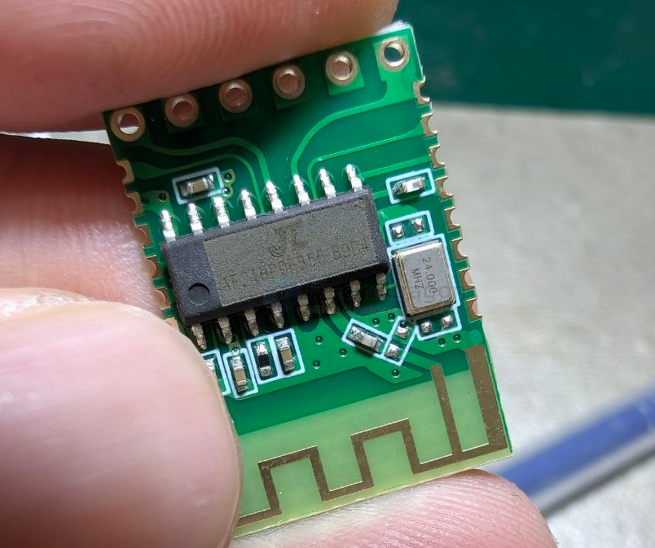
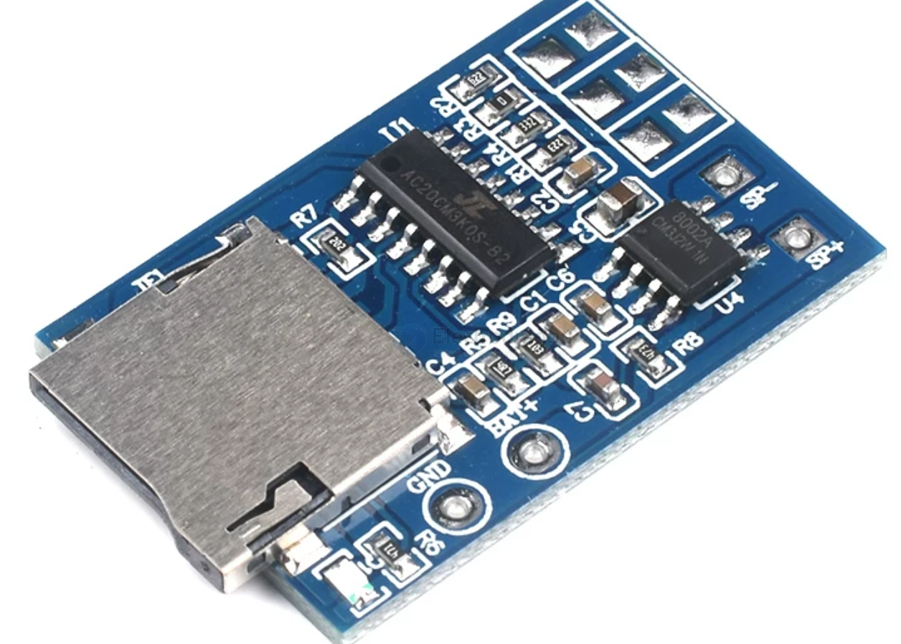
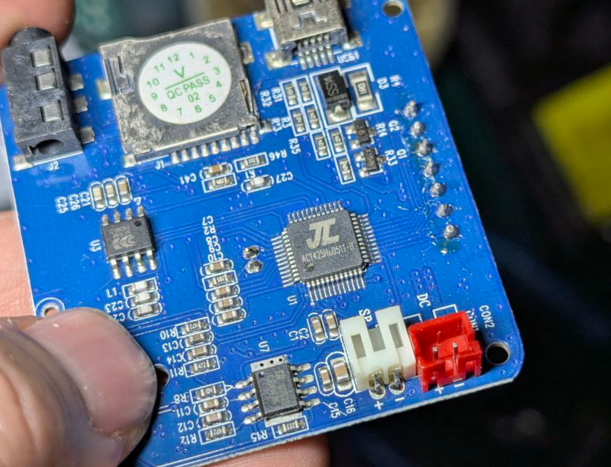

# jieli-dat

https://github.com/kagaimiq/jielie

- [[AC69xx-dat]] - [[AC208-dat]]

- [[jieli-datasheets-dat]] - [[jieli-chip-marks-dat]] - [[jieli-lots-dat]]

https://doc.zh-jieli.com/vue/#/home

- AC79
- AC63 

- [[amplifier-audio-dat]]

## AC6939 

AC6939B SOP16 

ref == https://hackaday.io/project/184542-i-made-my-own-audio-bluetooth-module/details

## AF21? AF24 ? == 

JL Jieli AF21BP0F355 B9D4 ? 

MP3 Player: The larger 16- or 24-pin audio decoder chip is usually a MH2024K-24SS, or one of the many compatible alternatives, such as MH2024K-16SS, YX5200-24SS, or clones like the AB23…, AB24…, AF24… series from Chinese manufacturers like Jieli Technology (JL).

- APP向串口通信最大速率12KBYTE/S
- 串口向APP通信最大速率6KBYTE/S
- BLE5.1
- 双模蓝牙
- 音频+BLE == [[audio-dat]] + [[BLE-dat]] == [[jielie-dat]] - [[JL-AF24-dat]] - [[bluetooth-dat]] - [[EY-68A-dat]]
- 支持
- 10控制
- 串口透传
- 音频播放

also need [[audio-dat]] - [[amplifier-audio-dat]]

## AC20CM 

- [[amplifier-audio-dat]] - [[8002-dat]] - [[speaker-dat]] - [[bt-audio-dat]]

- [[MP3-dat]] - [[mp3-decoder-dat]] - [[microsd-dat]]

- 1、TF卡MP3解码板，不带TF卡，支持播放MP3音乐文件，目前测试16GTF卡支持，再大的还没试过，3.7锂电池或USB5V可供电。
- 2、板子右上角3组白色方框为3组轻触按键，中间一组为播放暂停键，上下2组短按为上下区键，上下2组长按为音量+-调节。
- 3、带2W单声道功放，5V供电时功放最大输出3W，建议搭配4欧3W插卡小音箱上的小喇叭，音质好，声音很大，如果觉得音量还不够大，请直接换4欧5瓦的喇叭，但要注意散热，要加散热片。
- 4、有顾客反映功放在播放音乐时，会有发热现象，功放芯片或功放管发热是正常的，只要不把功放开到大音量之后，短路喇叭的输出端（阻值0欧）是不会烧功放芯片的，可放心使用。
- 5、如不需要这款板子的功放，自己接功放，可按如下改装，把板子的功放芯片（8脚的芯片）去掉，然后从主控的第4脚和第6脚，（这两个脚是主控芯片左右声道输出）各串联一个104或224的电容去功放的输入端即可（电容起隔离作用，以防同一电源供电时烧前级主控芯片或后期的功放管）剩下一根线从负极去功放输入的公共端。
- 6、如要把这个板子改装用耳机听音乐的，把板子的功放芯片（8脚的芯片）去掉，然后从主控的第4脚和第6脚（这两个脚是主控芯片的左右声道输出）各串联一个104或224的电容去耳机的左右声道，剩下一根线从负极接去耳机的公共端。

## AC410N

AC410N: AC410N series is a Bluetooth audio chip series, with low power consumption and high performance microprocessor of 96KB SRAM, integrated 32-bit RISC CPU and rich peripheral circuits. The characteristics of this series are chips, which are launched for low power consumption applications, and the Bluetooth version is 2.0+EDR.

[Official website]: http://www.zh-jieli.com/

## JL AC1425

## AC6965A 

## AC63N 

## more info

- [What do the chip markings mean](chip-marks.md)
- [Pinout diagrams](pinout-diagrams/index.md) - far from complete
- [Datasheets](datasheets.md) - for now for a few chips, linking to external resources..

## Chip series

### Generic MCU

- AD14N (SH54)
- AD15N (SH55)
- AD16N (UC03)
- AD104N (SH54)
- AD105N (SH55)

### Generic Audio

- [AC109N (CD002 / CD02)](cd02/index.md#ac109n)
  - AC1082
  - AC1083
  - AC1085
  - AC1094
- AC119N (CD005 / CDN5)
  - AC1187
- AC209N
- AC309N
- [AC608N (BR25)](br25/index.md#ac608n)

### Bluetooth Audio

- [AC410N (CD03)](cd03/index.md#ac410n)
- AC460N (BT15)
- [AC461N (BC51)](bc51/index.md#ac461n)
- [AC690N (BR17)](br17/index.md#ac690n)
- [AC691N (BR20)](br20/index.md#ac691n)
- [AC692N (BR21)](br21/index.md#ac692n)
- AC693N (BR22)
- [AC695N (BR23)](br23/index.md#ac695n)
- [AC696N (BR25)](br25/index.md#ac696n)
- AC697N (BR30)
- AC700N (BR36)
- AC701N (BR28)
- AC897N (BR30)
- AD697N (BR30)
- AD698N (BR34)

### Generic Bluetooth

- AC630N (BD29)
- AC631N
- AC632N (BD19)
- [AC635N (BR23)](br23/index.md#ac635n)
- [AC636N (BR25)](br25/index.md#ac636n)
- AC637N
- AC638N (BR34)

### Video

- [AC520N (DV12)](dv12/index.md#ac520n)
- [AC521N (DV15)](dv15/index.md#ac521n)
- AC530N (DV11)
- [AC540N (DV16)](dv16/index.md#ac540n)
- [AC560N (DV16)](dv16/index.md#ac560n)
- AC570N
- AC571N

### Wireless wi-fi or something like that idk

- AC790N (WL80)
- AC791N (WL82)

### to be determined

- AD13N
- AC61N
- AC64N
- AC81N
- AC91N
- AC104N - maybe that's AD104N
- AC812N
- AC889N
- AC890N
- AC897N
- AC951N
- AC961N
- AD140N
- AD142N
- AD145N
- AD146N
- AD153N
- AD154N
- AD156N
- AD158N
- AD159N
- AI800N (BR18)

## Chip families

Or a *design name*, or a project name...

- HB01 (AC209N)
- HB02 (AC309N)
- HB03 (AC329N)
- [CD02 (AC109N)](cd02/index.md)
- [CD03 (AC410N)](cd03/index.md)
- BT15 (AC460N)
- [BC51 (AC461N)](bc51/index.md)
- DV11 (AC530N)
- [DV12 (AC520N)](dv12/index.md)
- [DV15 (AC521N)](dv15/index.md)
- [DV16 (AC540N, AC560N)](dv16/index.md)
- BD19 (AC632N)
- BD29 (AC630N)
- [BR17 (AC690N)](br17/index.md)
- BR18 (AI800N)
- [BR20 (AC691N)](br20/index.md)
- [BR21 (AC692N)](br21/index.md)
- BR22 (AC693N)
- [BR23 (AC695N, AC635N)](br23/index.md)
- [BR25 (AC696N, AC636N, AC608N)](br25/index.md)
- BR28 (AC701N)
- BR30 (AC697N, AC897N, AD697N)
- BR34 (AD698N, AC638N)
- BR36 (AC700N)
- WL80 (AC790N)
- WL82 (AC791N)
- [SH50 (AD100)](sh50/index.md)
- SH54 (AD14N, AD104N)
- SH55 (AD15N, AD105N)

## Misc chips

- [AV10](misc/av10.md) - CVBS (PAL/NTSC .. but not SECAM!) video decoder
- FT33 (AC3433) - an FM transmitter chip

### to be determined

- HB001 - AC209N
- HB002 - AC309N
- HB003 - AC329N
- MC001 - that OpenRISC thing?
- CD01
- CD02 - AC109N
- MC002
- CDN2
- MV01
- CDN3
- CDN4
- SH50 - AD100
- RA13
- RA14
- DV10 - maybe something like AC51xx? Blackfin arch
- SH60 - AD200 - where the uboot.boot's "UBOOT2.00" originated from?
- **CDN5 => AC119N : AC1187**
- **BT15 => AC460N**
- HC02
- CDN6
- DV11
- **DV12 => AC520N**
- **BC51 => AC461N**
- AV10 (- PAL/NTSC video decoder chip?!)
- SH52 - AD300
- BR16
- F93
- **BR17 => AC690N**
- FT33 (fm transmitter - AC3433)
- **DV16 => AC540N/AC560N**
- BR18 - AI800N
- UC02 - AC12N
- CD07
- WL30
- WM31
- FR66 (fm receiver)

## ref 

- [[JieLi-dat]]

- [[jielie]]