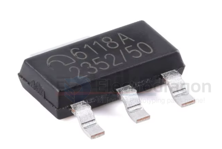
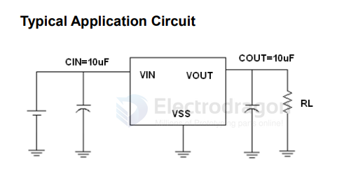

# ME6118-dat

- [[ME6118-dat]] - [[microne-dat]]

6118A 

1A Adjustable Voltage High Speed LDO Regulators ME6118 Series

The ME6118 series are highly accurate, low noise, LDO Voltage Regulators that are capable of providing an output current that is in excess of 1A with a maximum dropout voltage of 1.3V at 1A （ME6118A33）.This series contains four fixed output voltages of 1.2V, 1.8V, 2.5V and 3.3V that have no minimum load requirement to maintain regulation. On chip trimming adjusts the reference/output voltage to within ±2% accuracy.

Internal protection features consist of output current limiting, safe operating area compensation, and thermal shutdown. The ME6118series can operate with up to 18V input. 

Features
Output Current in Excess of 1A
Dropout Voltage:80mV@ louT =100mA(ME6118A33)
Operating Voltage Range: 2.5V~18V
Highly Accuracy: ±2%
Adjustable Output Voltage Option
Standby Current: 52uA (TYP.)
High Ripple Rejection: 70dB@1KHz （ME6118A33)Line Regulation: 2mV (TYP.)
Temperature Stability≤0.5%
Thermal Shutdown Protection: 160C

## ref 

