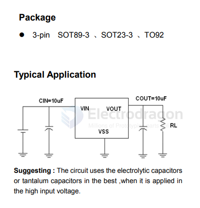

# ME6203-dat

100 mA, High Input Voltage LDO Linear Regulators ME6203 Series

## Features

-  High output accuracy：± 2%
-  Input voltage：up to 40 V
-  Output voltage：1.8V ~ 12V
-  Ultra-low quiescent current (Typ.= 3 µ A)
-  Output Current：IOUT = 100mA（When VIN = 5.5V and VOUT =3.3V）
-  Short-circuit Current：(Typ.= 20mA)
-  Low temperature coefficient
-  Ceramic capacitor can be used

## SCH 

## ref 

