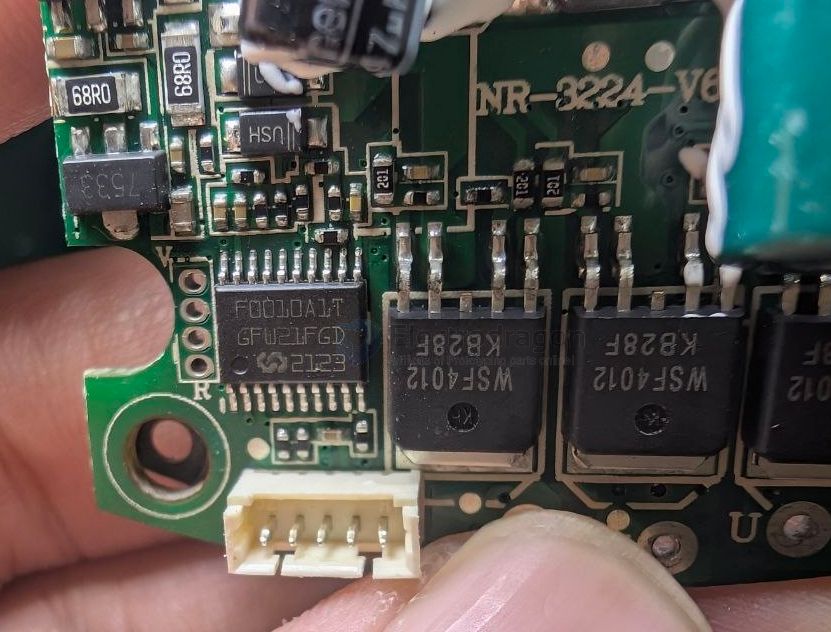

# mindmotion-dat

- [[mindmotion-dat]] - [[MCU-dat]] - [[ARM-dat]]

MM32F0010A1T - TSSOP-20 Microcontrollers (MCU/MPU/SOC) ROHS

本产品是使用高性能的  Arm ®  Cortex ® -M0  为内核的  32  位微控制器，最高工作频率可达 48MHz，内置高速存储器，丰富的 I/O 端口和外设连接到外部总线。本产品包含 1 个 12 位 的 ADC、1 个 16 位通用定时器、1 个 16 位基本定时器和 1 个 16 位高级定时器。还包 含标准的通信接口：1 个 I2C 接口、1 个 SPI 接口和 2 个 UART 接口。 本产品系列工作电压为 2.0V  ∼  5.5V，工作温度范围（环境温度）包含 -40°C  ∼  +85°C 的 工业型和 -40°C  ∼  +105°C 的扩展工业型（尾缀 V）。内置多种省电工作模式保证低功耗应用的要求。 

这些丰富的外设配置，使得本产品微控制器适合于多种应用场合： 
  节点控制 
  无线充电 
  电机控制 
  玩具 
  照明电路 
  应急消防设备 
  8/16 位 MCU 升级 

本产品提供 QFN20、TSSOP20 和 SOP8 共 3 种封装形式。

## build 

## ref 
