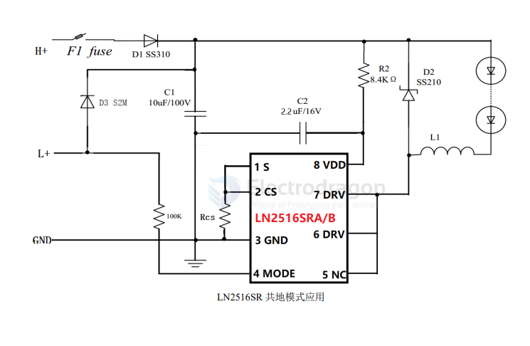
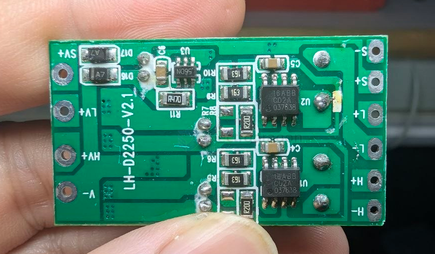
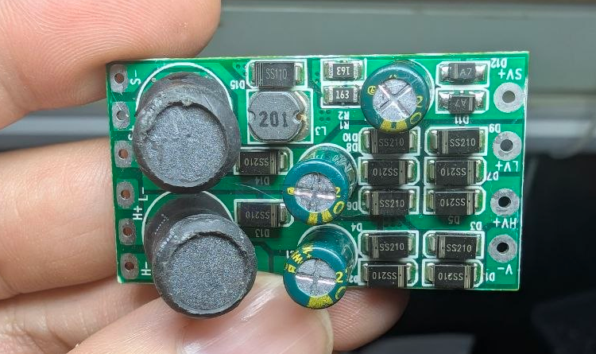
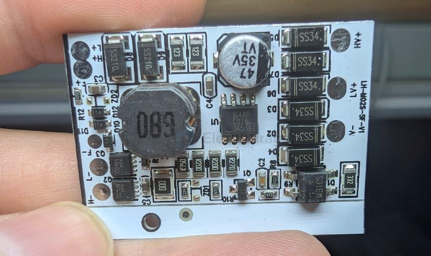

# LN2516-dat

- [[natlinear-dat]] - [[LN2566-dat]] - [[LED-driver-dat]] - [[LN2516-dat]]

LN2516 是一款外围电路简单，采用自主知识产权的VFPWM 连续工作模式，适用于 6-100V 全电压范围的非隔离式恒流 LED 驱动芯片。

LN2516 采用了 PWM 工作模式，在应用中可以采用较小值的电感，可以有效节省整机空间。LN2516 通过对 MODE端口进行控制实现二功能切换。MODE 悬空时为高亮模式，MODE 接高时为低亮模式，其中低亮电流为高亮电流的 50%。

■ 产品特点

-  宽输入电压范围：6V~100V
-  效率 88%
-  输出电流范围：100mA~3.5A
-  电源内置 7V 稳压管
-  平均电流工作模式
-  内置抖频电路
-  内置 100V 功率管
-  过温时减小输出电流

## SCH 

## build 

build 2 

build 1 

## ref 