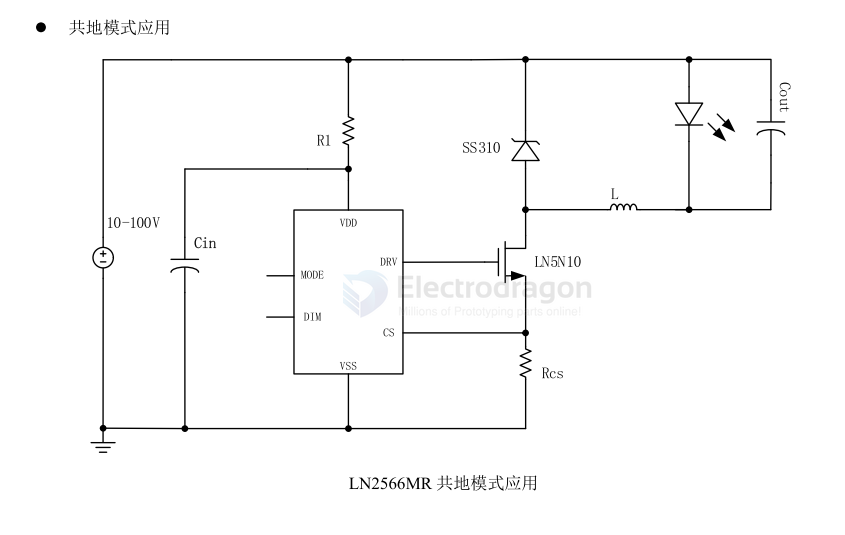

# LN2566-dat

- [[LN2566-DS.pdf]]

■产品概述

GS2566是一款外围电路简单，采用自主知识产权的VFPWM连续工作模式，适用于 8-100V全电压范围的非隔离式恒流LED驱动芯片。

GS2566采用了PWM 工作模式，在应用中可以采用较小值的电感，可以有效节省整机空间.GS2566通过对MODE端口进行控制实现二功能切换。MODE悬空为高亮模式，MODE接高为低亮模式，其中低亮电流为高亮电流的 50%。

用途
- •直流或交流输入LED 驱动器RGB背光LED
- •电动自行车照明
- •汽车照明等

产品特点
- 宽输入电压范围：8V~100V
- 效率大于 90%
- 输出电流范围：300mA~5A
- 电源內置稳压管过温保护电路
- 平均电流工作模式
- 定频率140KH

## APP 

## board 

- [[PCB-form-dat]] - [[LN2566-dat]]

## ref 