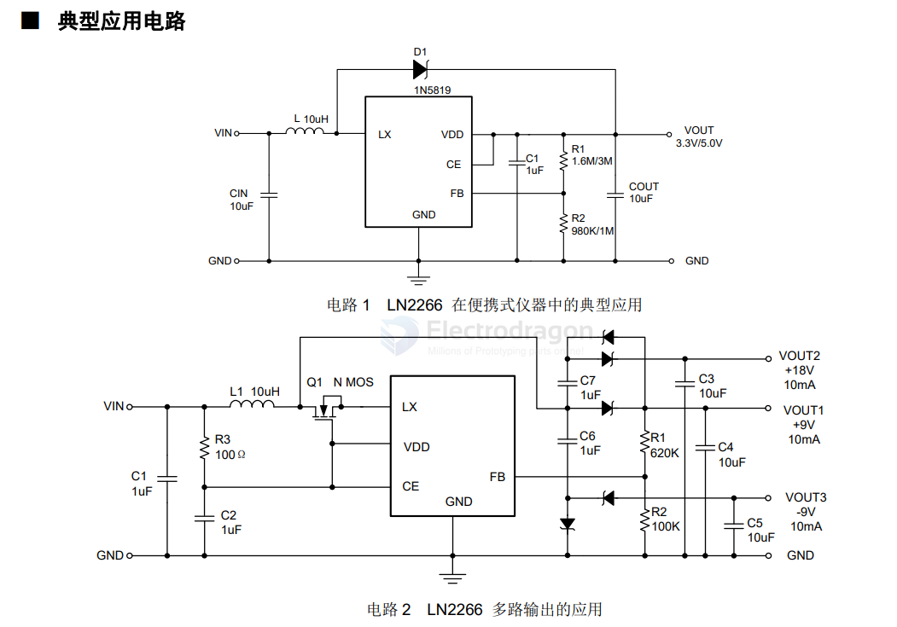

# natlinear-dat

- [[battery-charger-dat]] - [[natlinear-dat]]

- [[natlinear-dat]] - [[LN2054-dat]] - [[battery-charger-dat]]

- [[natlinear-dat]] - [[LN2566-dat]] - [[LED-driver-dat]]

LN2266 - Ultra-small, Low-voltage Start-up PWM Controlled Boost DC/DC Regulator

## Overview

The LN2266 is a miniature, high-efficiency, boost DC/DC regulator. The circuit consists of a current-mode PWM control loop, error amplifier, ramp generation circuit, comparator, and a power switch. It operates efficiently and stably across a wide load range. With a start-up voltage below 1V, it can be powered by 1-4 battery cells. When using a lithium battery, it provides an output current of up to 1100mA. The 17μA quiescent current and up to 90% conversion efficiency effectively extend battery life. The output voltage can be set by adjusting two external resistors. It includes a built-in 2.5A power switch.

## Applications

- MP3 / PDA
- Electronic Dictionaries / Learning Machines
- RF Tags
- Portable Mobile Devices
- Wireless Communication Equipment
- DSC, LCD Displays

## Features

| Feature | Specification |
| :--- | :--- |
| **Low Voltage Operation** | Guaranteed start-up at 0.9V (Iout=1mA) |
| **Switching Frequency** | 1000 kHz |
| **Conversion Efficiency** | 90% |
| **Output Current** | 3.3V / 300mA (Single Alkaline Battery) 5V / 1100mA (Single Lithium Battery) |
| **Voltage Accuracy** | Adjustable from 2V to 5.2V, accuracy up to ±2.0% |
| **Quiescent Current** | Typical 17 μA |
| **Shutdown Current** | Typical 0.01 μA |
| **Packages** | SOT23-6L, SOT89-5L |

## ref 

