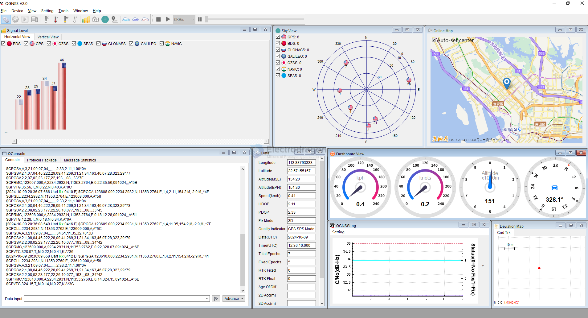
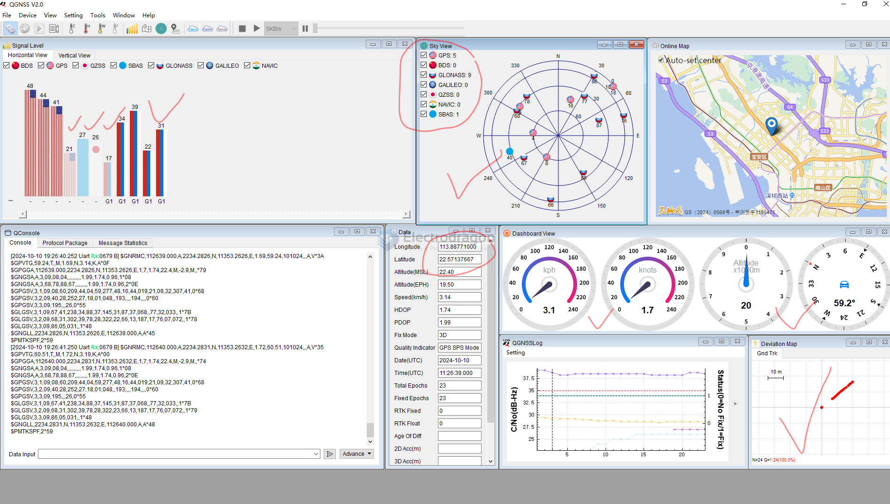

# L76-log-dat

log L76-B

    $GNRMC,123237.000,A,2234.2668,N,11353.2406,E,1.12,69.88,091024,,,A*4D
    $GNVTG,69.88,T,,M,1.12,N,2.08,K,A*14
    $GNGGA,123237.000,2234.2668,N,11353.2406,E,1,6,2.26,-28.2,M,-2.9,M,,*4F
    $GPGSA,A,3,21,04,09,08,,,,,,,,,2.46,2.26,0.98*03
    $BDGSA,A,3,07,10,,,,,,,,,,,2.46,2.26,0.98*12
    $GPGSV,2,1,07,08,80,318,33,42,50,127,,04,47,223,31,09,41,272,32*7C
    $GPGSV,2,2,07,21,32,164,43,193,,,,02,,,28*7B
    $BDGSV,1,1,04,07,72,285,35,10,61,263,39,02,,,27,03,,,35*6E
    $GNGLL,2234.2668,N,11353.2406,E,123237.000,A,A*49

log L76-R 

    $GPGGA,123641.000,2234.2597,N,11353.2418,E,1,5,1.78,95.4,M,-2.9,M,,*7E
    $GPGLL,2234.2597,N,11353.2418,E,123641.000,A,A*5E
    $GPGSA,A,3,21,09,07,04,08,,,,,,,,2.01,1.78,0.93*04
    $GPGSV,3,1,09,08,79,327,36,27,49,030,30,04,46,222,24,09,41,269,30*7F
    $GPGSV,3,2,09,21,34,162,46,07,28,323,25,02,23,177,18,26,09,077,*7C
    $GPGSV,3,3,09,193,,,*4B
    $GPRMC,123641.000,A,2234.2597,N,11353.2418,E,0.54,242.92,091024,,,A*69
    $GPVTG,242.92,T,,M,0.54,N,1.00,K,A*32

log L76-L 

    $GNRMC,112521.000,A,2234.2742,N,11353.2516,E,0.00,242.91,101024,,,A,V*05
    $GPVTG,242.91,T,,M,0.00,N,0.00,K,A*31
    $GPGGA,112521.000,2234.2742,N,11353.2516,E,1,6,2.71,19.1,M,-2.9,M,,*74
    $GNGSA,A,3,09,08,04,,,,,,,,,,2.88,2.71,0.98,1*03
    $GNGSA,A,3,68,78,88,,,,,,,,,,2.88,2.71,0.98,2*04
    $GPGSV,2,1,08,08,60,209,44,04,59,277,49,16,44,019,29,09,32,307,42,0*62
    $GPGSV,2,2,08,40,28,252,,193,,,,194,,,,195,,,,0*6C
    $GLGSV,2,1,07,87,37,069,,88,36,145,36,68,31,303,40,78,28,322,28,1*7C
    $GLGSV,2,2,07,66,14,187,,86,05,031,,67,,,,1*7C
    $GNGLL,2234.2742,N,11353.2516,E,112521.000,A,A*42
    $PMTKSPF,2*59

## QGNSS 

data log 1 

GNSS data log 2 

## demo video 

- search at youtube @electrodragonfan  https://www.youtube.com/@electrodragonfan/shorts