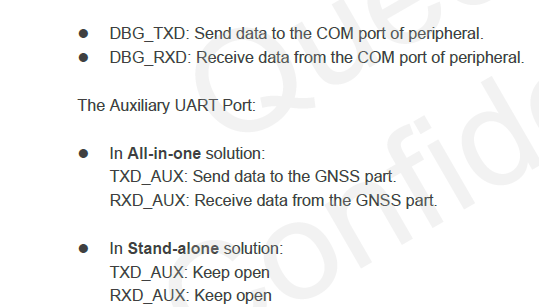
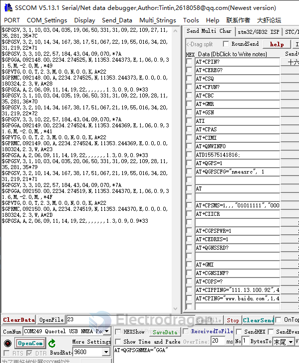

## AT+QGNSSC GNSS Module Power Control

- [[quectel-SSCOM-AT-GNSS-dat]]

- [[quectel-CME-error-code-dat]]

## 3.1. Turn On and Off the GNSS Engine

    AT+QGPS=1 //Turn on GNSS engine.
    OK

    AT+QGPSLOC? //Obtain position information.
    +QGPSLOC: 061951.0,3150.7223N,11711.9293E,0.7,62.2,2,0.0,0.0,0.0,110513,09

## GNSS 

AT+QGNSSC=1 // working for MC20

## AT+QGNSSRD?

for error

    AT+QGNSSRD?
    +CME ERROR: 7103

- If it’s the MC60 EVB, please make sure the DIP switch (S101,S102) is correctly set.
- connect GPS UART port to AUX UART port 

the correct output 

    AT+QGNSSRD?

    +QGNSSRD: 

    $GNRMC,092220.000,A,2234.2803,N,11353.2519,E,0.09,178.55,170323,,,A*7C
    $GNVTG,178.55,T,,M,0.09,N,0.17,K,A*22
    $GNGGA,092220.000,2234.2803,N,11353.2519,E,1,4,2.00,25.2,M,-2.9,M,,*68
    $GPGSA,A,3,06,19,17,14,,,,,,,,,2.24,2.00,1.00*08
    $BDGSA,A,3,,,,,,,,,,,,,2.24,2.00,1.00*14
    $GPGSV,2,1,08,14,67,161,33,06,52,285,40,17,51,016,31,50,46,122,27*7E
    $GPGSV,2,2,08,19,40,334,28,193,,,,194,,,29,195,,,*72
    $BDGSV,1,1,02,03,,,33,13,,,31*69
    $GNGLL,2234.2803,N,11353.2519,E,092220.000,A,A*48

Location at N,11353.2519,E,092220.000

## AT+QCELLLOC=1

    AT+QCELLLOC=1
    +CME ERROR: 3818

    7103 Operation failed

## AT+GNSSEPO=1

## AT+QGEPOAID

## AT+QGNSSTS Get Time Synchronization Status for GNSS Module

    AT+QGNSSTS?
    +QGNSSTS: 1

    OK

## ref 

- https://sisoog.com/wp-content/uploads/2019/12/Quectel_MC20_GNSS_AT_Commands_Manual_V1.1.pdf

## config 

    AT+QGPSCFG=?

When GNSS was started, you can turn on <nmeasrc> feature

    AT+QGPSCFG="nmeasrc", 1 //Enable nmeasrc functionality.
    OK

    AT+QGPSEND

## GNSS - EC20

    AT+CGPSPWR=1

USB NEMA data 

### AT+QGPS turn on GPS 

AT+QGPS=1 

### AT+QGPSGNMEA

GGA 

    AT+QGPSGNMEA="GGA" //Obtain GGA sentence.
    +QGPSGNMEA: $GPGGA,103647.0,3150.721154,N,11711.925873,E,1,02,4.7,59.8,M,-2.0,M,,*77

GSV

    AT+QGPSGNMEA="GSV"
    +QGPSGNMEA: $GPGSV,3,1,12,06,49,334,37,09,23,108,26,11,35,284,37,12,07,320,26*7B
    +QGPSGNMEA: $GPGSV,3,2,12,14,32,167,31,17,50,068,25,19,56,019,26,20,32,219,30*7A
    +QGPSGNMEA: $GPGSV,3,3,12,22,56,182,45,03,04,035,,04,09,068,,05,,,*44

    OK

### AT+QGPSLOC

AT+QGPSLOC?

    AT+QGPSLOC?
    +QGPSLOC: 092555.0,2234.2741N,11353.2434E,0.7,35.0,2,0.00,0.0,0.0,180324,08

    OK
