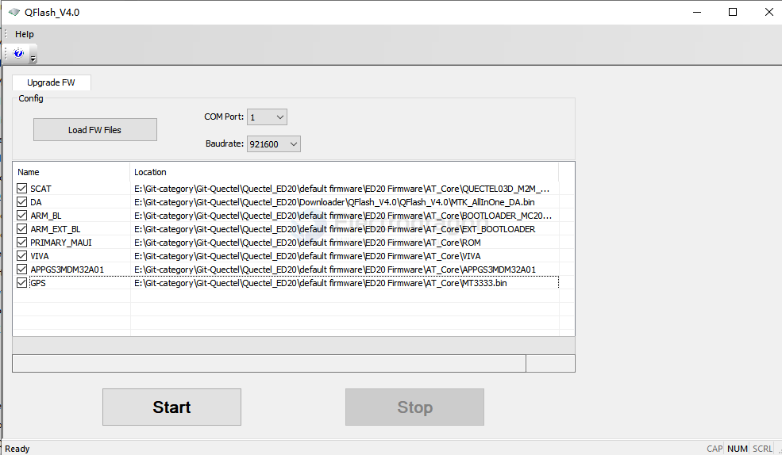
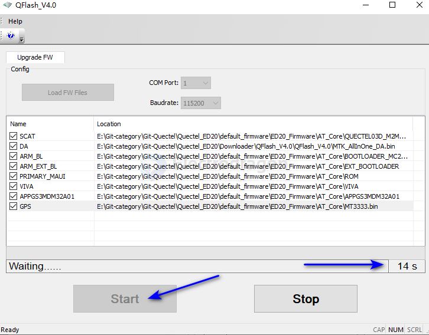
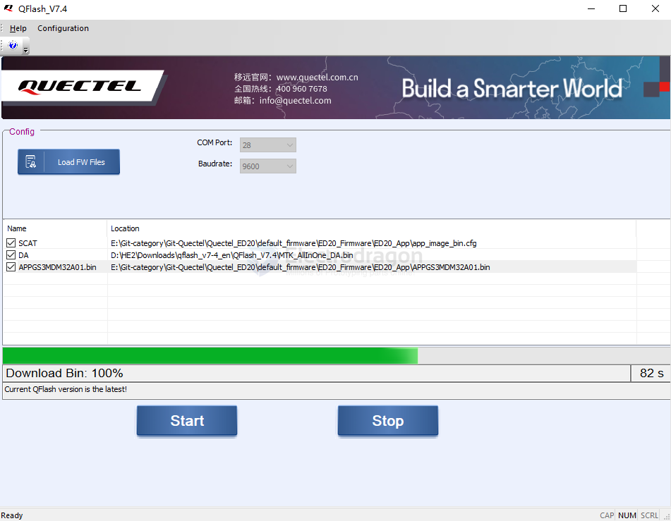

# quectel-SDK-dat

## firmware flash tools 

== [[Qflash-dat]]

[QFlash_V7.4_EN](https://www.quectel.com/download/qflash_v7-4_en/)

## For [[NGS1063-dat]], select the correct firmware: 

click start and wait

press boot button to start flashing 

## errors 

FAIL, COM:348, FlashToolError:1011, S_COM_PORT_OPEN_FAIL

- some [[serial-dat]] chips are not fully supported error, probably, try another [[serial-dat]] board with a different chip 

## ref 

- [[quectel-dat]] - [[NGS1063-SDK-dat]]

- [[serial-dat]]