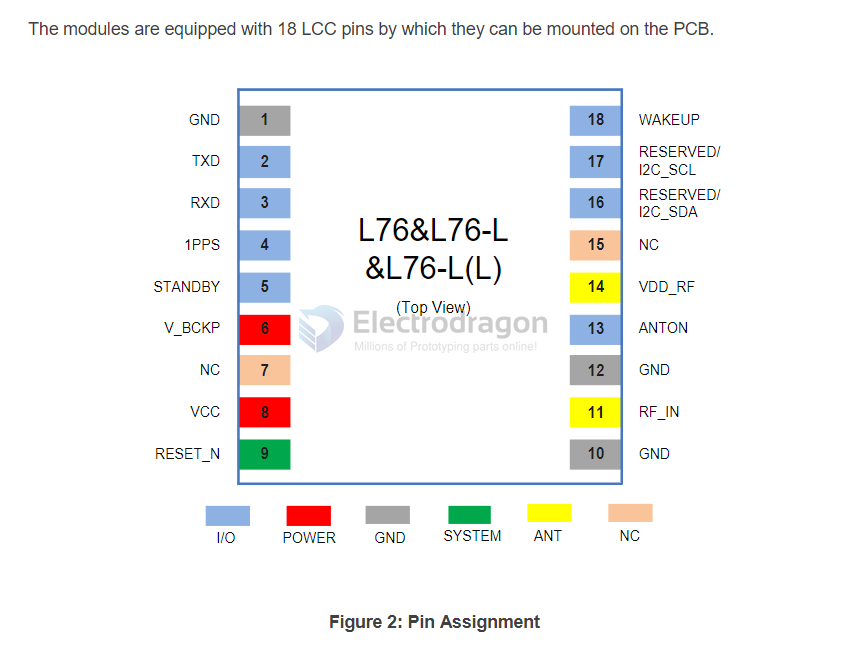

# L76-dat

- https://www.quectel.com/product/gnss-l76-l/

The module can be connected to a dedicated passive or an active single-band GNSS antenna in order to track the GNSS satellite signals. 

- [[quectel_l76_series_hardware_design_v3-3.pdf]]

## chip map 

