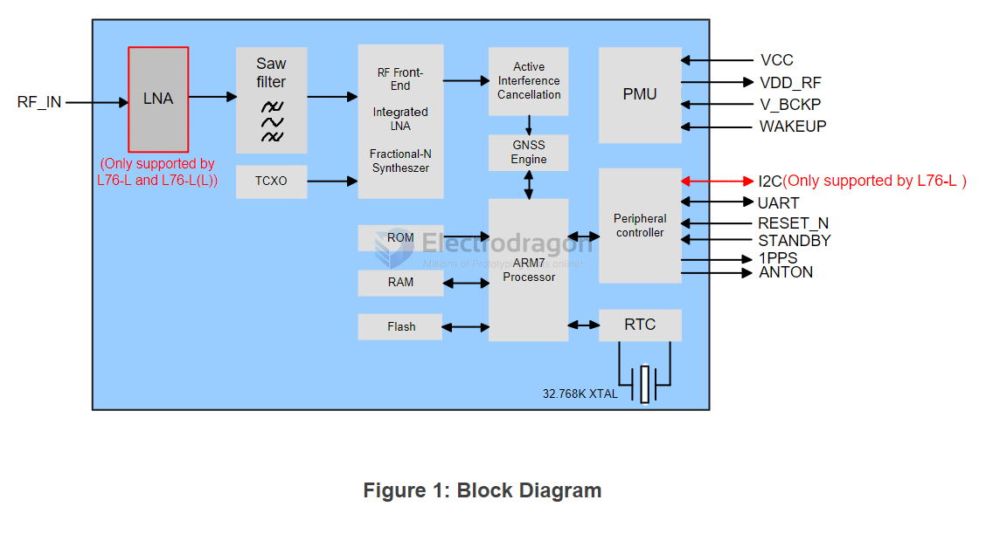
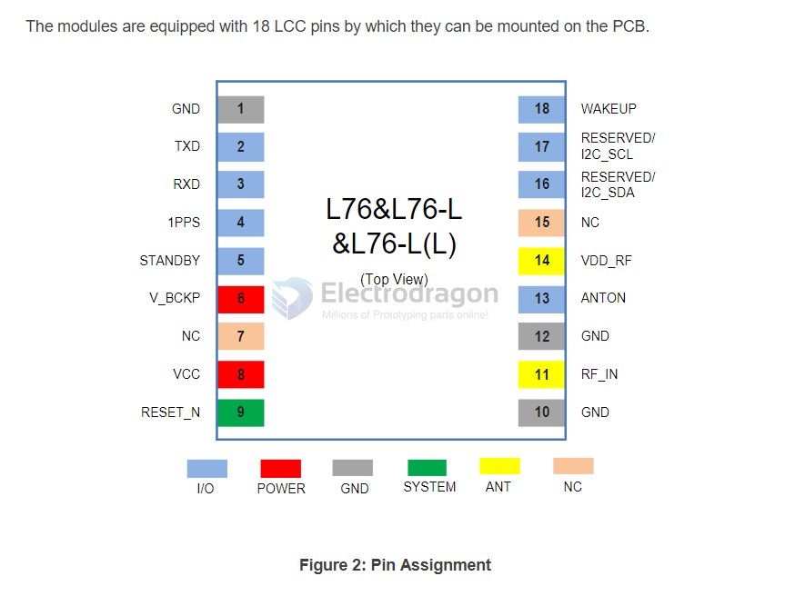

# L76-dat

## features 

- 超小尺寸：10.1mm×9.7mm×2.5mm
- 支持多重卫星系统：GPS、GLONASS、Galileo和QZSS
- 支持EASYTM自生成轨道预测技术，实现快速定位
- AGPS技术缩短首次定位时间
- 内置低噪声放大器，提高接收灵敏度
- 极低的电流消耗：19mA@追踪模式
- AlwaysLocateTM模式，实现周期模式智能控制
- LOCUS技术，支持日志信息自动记录保存
- 信道数：99个捕获信道，33个追踪信道，210个PRN信道
- 支持DGPS,SBAS（WAAS/EGNOS/MSAS/GAGAN)
- 支持UART和I2C接口
- 多频主动干扰消除技术增强抗干扰能力
- 支持Balloon模式，定位高度高达80km授时服务支持PPS与NMEA同步功能
- 支持移远通信自主研发的SDK命令

多卫星定位系统

L76-L 是一款集成GPS、GLONASS、QZSS 和 Galileo多卫星定位系统的并发接收型模块，尺寸超小，并拥有33个追踪信道，99个捕获信道和210个PRN信道，能够追踪和捕获任何GPS、GLONASS和SBAS混合信号。在封装上兼容移远通信L76GNSS模块，内置LNA，可在弱信号环境中获得更好的性能。

高精度定位

与单一的GPS系统相比，
L76-L的GLONASS和GPS多定位系统使得可见和可用卫星数目大幅度增加，同时大大缩减首次定位时间，即使是在复杂的城市环境下行驶也能实现更高的定位精度和准确度。

高灵敏度

通过先进的AGPS（EASYTM)轨道预测技术和省电模式（AlwaysLocateTM技术），L76-L模块性能高并且完全满足工业标准。EASYTM技术使得L76-L能自动计算和预测长达三天的轨道信息，并将这些信息存储到内部RAM存储器中，即使在室内弱信号情况下也能实现低功耗快速定位。AlwaysLocateTM技术的运用，使得L76-L可以根据不同的环境状况和运行模式，自动调节定位时间，在确保定位精度的同时大大降低了模块功耗。

超低功耗

L76-LB的超强性能为工业级PDA、消费类和工业应用领域提供了理想的解决方案。超低功耗满足了便携式设备对功耗的高要求，为此类应用的集成提供了便利。

## info 

- https://www.quectel.com/product/gnss-l76-l/

The module can be connected to a dedicated passive or an active single-band GNSS antenna in order to track the GNSS satellite signals. 

- [[quectel_l76_series_hardware_design_v3-3.pdf]] 

- [[quectel_l76_seriesl96_gnss_raw_measurements_application_note_v1-0.pdf]]

- [[GNSS-EVB_SCH_V2.01_130614.pdf]] - [[quectel_l76_series_evb_user_guide_v2-1.pdf]]

## variations 

- [[L76-K-dat]] - [[L76-B-dat]] - [[L76-LB-dat]] - [[L76-L-dat]] - [[L76-LL-dat]]

## L76 features 

- Compact GNSS module
- 10.1 mm × 9.7 mm × 2.3 mm
- 0.5 g
- GPS, GLONASS, BeiDou, Galileo and QZSS
- 99 acquisition channels and 33 tracking channels
- Operating temperature of -40°C to +85°C

## L76 VS L76-L VS L76-B

| model | status    | systems                                 | channels      |
| ----- | --------- | --------------------------------------- | ------------- |
| L76-K |           | GPS/GLONASS/BDS/QZSS                    |               |
| L76-L | available | GPS, GLONASS (or BDS), Galileo and QZSS | 33track/99acq |
| L76   |           |                                         |               |
| L76-B | available | GPS/BDS/QZSS                            |               |
| L70   | NA        | GPS + QZSS                              |               |
| L70-R | available | GPS + QZSS                              |               |

- L76-L supports: Additional LNA, I2C

| model    | LNA | Vio      | extra |
| -------- | --- | -------- | ----- |
| L76      |     | 2.7-2.9V |       |
| L76-L    | y   | 2.7-2.9V | I2C   |
| L76-L(L) | y   | 1.7-1.9V |       |

- L76L-M33  is L76-L. = 2.7-2.9V Vio
- L76LL-M33 is L76-L(L). = 1.7-1.9V Vio 

https://forums.quectel.com/t/l76-module-naming-and-i-o-voltage-l76l-m33/22934/3

## block diagram 

## standby mode 

Pulling STANDBY pin low will make the GNSS module enter Standby mode and releasing STANDBY pin which has been pulled high internally will make the modules back to Continuous mode. 
Note that pulling  down  STANDBY  pin  to  ground  will  cause  the  extra  current  consumption  which  makes  the typical Standby current reach to about 600 μA @ VCC=3.3 V.

Sending corresponding command will make the modules enter Standby mode. Sending any data via UART will make the modules exit standby mode as UART is still accessible in Standby mode.

## chip map 

## hardware 

### antenna design 

1. There is no need to use an additional LNA for L76-L and L76-L(L) modules, because there is already an embedded LNA inside these two modules.
2. The selected LNA should support both GPS and GLONASS system. For more information, pleasecontact Quectel technical supports.
3. The power consumption of the device can be reduced by controlling the LNA ENABLE pin throughthe ANTON pin of the modules. If ANTON function is not used, please connect the LNA ENABLEpin to VCC and keep LNA always on.

### version check 

- $PQVERNO,R*3f

## boards 

- [[NGS1103-dat]]

## ref 

- [[L76-log-dat]]

- [[antenna-dat]] - [[gps-dat]] - [[quectel-gps-dat]] - [[quectel-dat]] - [[gnss-dat]]

- [[GPS-antenna-design-dat]]

- [[MT3333-dat]] - [[MTK-dat]]

- [[cuper-cap-dat]]

- [[L76]]