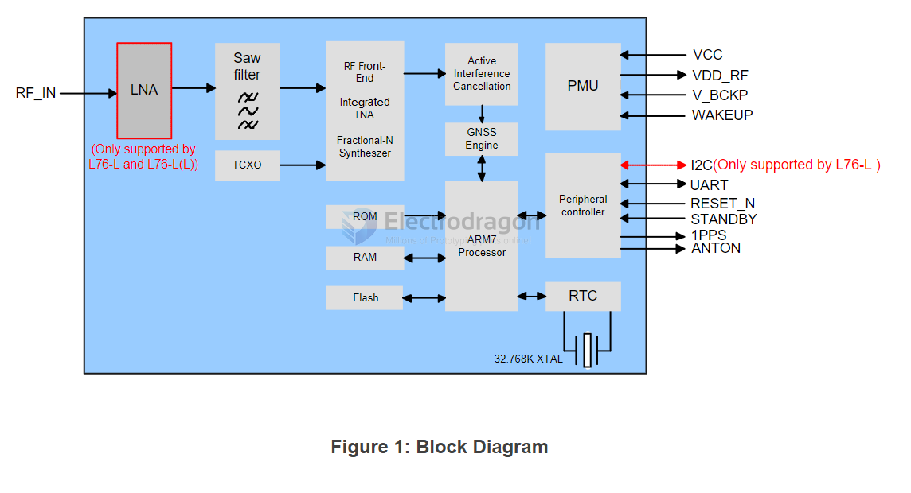

# L76-dat

- https://www.quectel.com/product/gnss-l76-l/

The module can be connected to a dedicated passive or an active single-band GNSS antenna in order to track the GNSS satellite signals. 

- [[quectel_l76_series_hardware_design_v3-3.pdf]]

## L76 VS L76-L VS L76-B

- L76-L supports: Additional LNA, I2C

## block diagram 

## standby mode 

Pulling STANDBY pin low will make the GNSS module enter Standby mode and releasing STANDBY pin which has been pulled high internally will make the modules back to Continuous mode. 
Note that pulling  down  STANDBY  pin  to  ground  will  cause  the  extra  current  consumption  which  makes  the typical Standby current reach to about 600 μA @ VCC=3.3 V.

Sending corresponding command will make the modules enter Standby mode. Sending any data via UART will make the modules exit standby mode as UART is still accessible in Standby mode.

## chip map 

## ref 

- [[antenna-dat]] - [[gps-dat]]

- [[L76]]