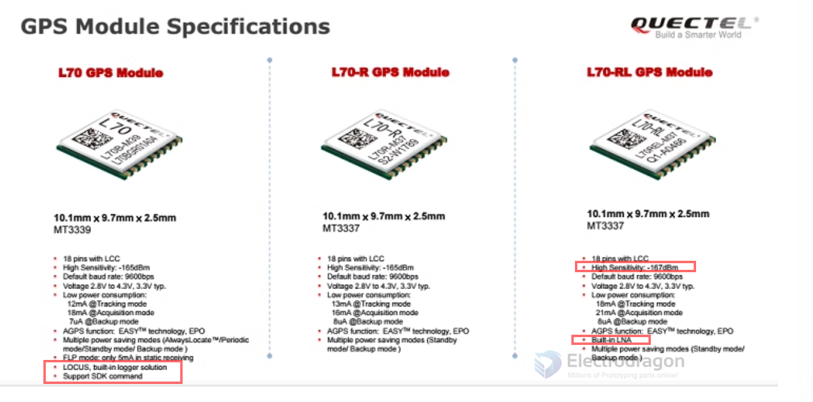

# quectel-gps-dat 

- legacy wiki page : https://w.electrodragon.com/w/Quectel_GNS

- [[NGS1100-dat]] - [[NGS1097-dat]] - [[quectel-gps-dat]] - [[GPS-dat]]

https://www.electrodragon.com/product/quectel-gps-gnss-series-mini-module-version/?attribute_pa_board-type=l70

- [[NGS1100-dat]] - [[NGS1101-dat]] - [[NGS1102-dat]] - [[NGS1103-dat]]

- [[L76-dat]]

## L70 series 

- L70 EOF
  

## L80 series 

## software 

QGNSS tool
- https://www.quectel.com/download_zone/

QCOM
- [[serial-dat]]

## ref 

- [[gps-dat]] - [[gnss-dat]]