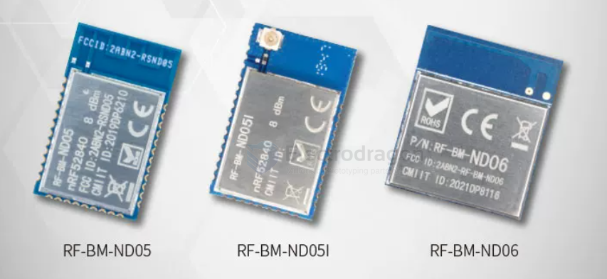

# rf-star-dat

- [[NRF52840-dat]]

- [[ND05-dat]] - [[ND06-dat]]

- 64 MHz ARM°Cortex-M4F
- 8 dBm
- RAM/Flash 256 kB/1 MB
- BLE 5.0, Proprietary, Thread, Zigbee, ANT, NFC, Matter
- -103 dBm @ 125 kbps LE Coded PHY, -95 dBm @1 Mbit/s BLE
- TX:6.4mA@0dBm，休眠电流：3.16μA全内存保留和RTC
- -40℃~+85℃

- [[bluetooth-dat]]

## ref 

- [[rf-star]]

