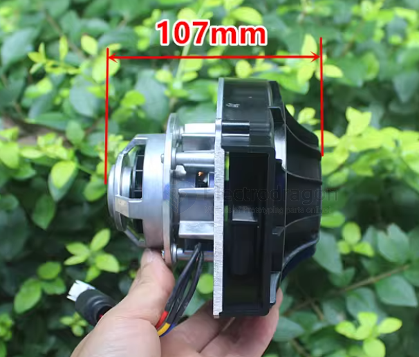
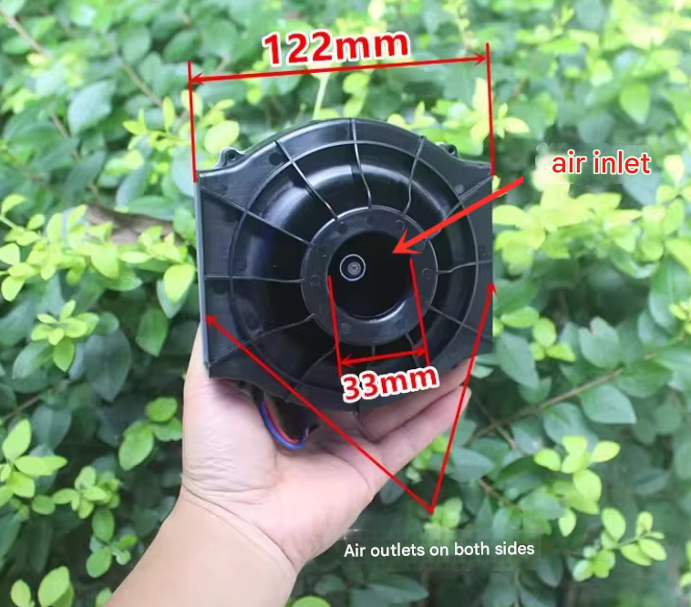

# ruiyi-dat

- [[motor-brushless-dat]] - [[vacuum-cleaner-dat]] - [[ruiyi-dat]]

## ruiyi motor Technical Specification Profile: Ruiyi ZL4815-L-B01

## 1. Overview
The **Ruiyi ZL4815-L-B01** is an industrial-grade, high-torque Brushless DC (BLDC) motor designed for electric vehicles (EVs), mid-drive scooters, and heavy-duty automation.

---

## 2. Electrical & Thermal Specifications
| Feature               | Specification       | Engineering Context                           |
| :-------------------- | :------------------ | :-------------------------------------------- |
| **Model**             | ZL4815-L-B01        | ZL Series; 48V; ~1.5kW Class                  |
| **Rated Voltage**     | 48V DC              | Optimized for 13S Li-ion or 4P Lead-Acid      |
| **Motor Type**        | BLDC (Inner Rotor)  | Electronic commutation via Hall Sensors       |
| **Insulation Class**  | **Class F (155°C)** | High-temp tolerance for sustained heavy loads |
| **Est. Power Output** | 1000W - 1500W       | Professional grade (NOT a toy motor)          |
| **Est. Rated Speed**  | 3000 - 3600 RPM     | Requires gear reduction for vehicle use       |
| **Wiring**            | 3 Phase + 5 Hall    | Standard 8-wire BLDC configuration            |

## 3. Wiring Configuration

### Phase Wires (Power)
* **Colors:** Yellow, Green, Blue (Heavy Gauge)
* **Function:** Transmits 3-phase AC power from the controller to the motor windings.

### Hall Sensor Wires (Signal)
* **Red:** +5V DC (Power for internal sensors)
* **Black:** GND (Ground)
* **Yellow/Green/Blue:** Position signals for precise timing.

## 4. Engineering Analysis for Human Scooter Project

### Torque vs. Speed
Unlike the 775 or Vacuum motors, this motor has a large **thermal mass**. It can handle high **Stall Current (Locked-Rotor Current)** during startup without immediate overheating, which is critical for moving a 70kg+ rider from a stop.

### Gear Ratio Recommendation
To achieve a balanced top speed of ~35 km/h on 10-inch wheels, you should aim for a **5:1 or 6:1 reduction ratio**.
* **Motor Sprocket:** 9T or 11T
* **Wheel Sprocket:** 54T or 60T
* **Drive Type:** #25 or T8F Steel Chain (Do not use plastic belts for this power level).

## 5. System Requirements Summary

Required Components for ZL4815 Setup:

1. Battery: 48V (Minimum 15Ah - 20Ah capacity)
2. Controller: 48V 30A-45A Brushless DC Controller (Sensored)
3. Throttle: Hall-effect 3-wire Thumb or Twist Throttle
4. Protection: 50A DC Circuit Breaker or Inline Fuse
5. Cooling: Open-air mounting (Class F handles heat well, but needs airflow)

Verdict: This motor is highly recommended for a human-carrying scooter. It provides the necessary power-to-weight ratio and industrial insulation to ensure safety and longevity under load.

## ref 

- [[motor-dat]] - [[motor-brushless-dat]] - [[ruiyi-dat]]