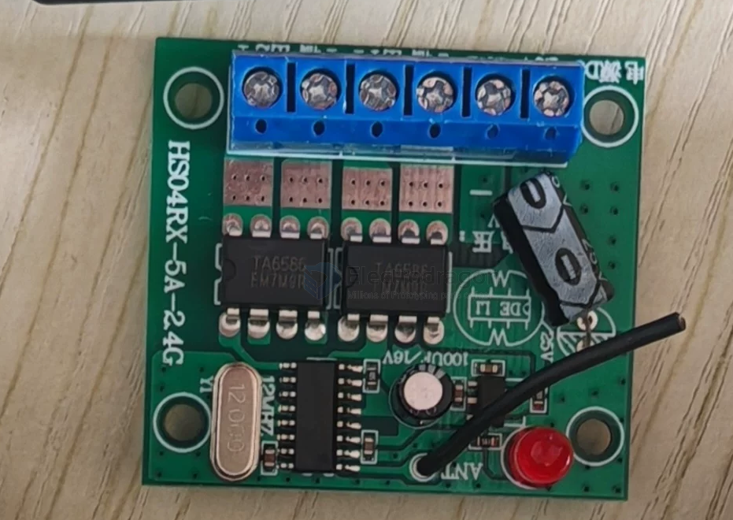
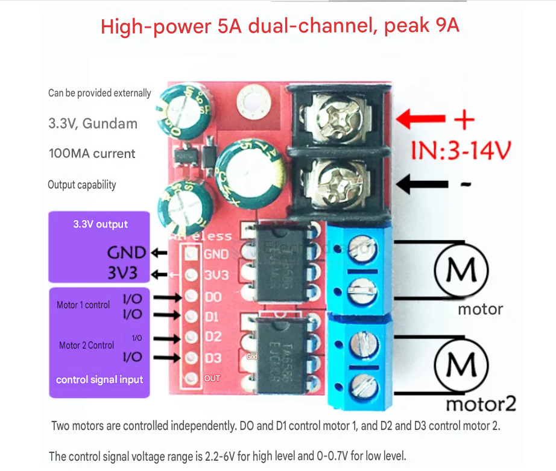

# TA6586-dat

- [[TA6586-dat]] - [[motor-driver-dat]] - [[ruizhi-dat]]

The TA6586 is a monolithic H-bridge motor driver IC manufactured by Wuxi Ruizhi Microelectronics. It is widely used in Arduino, Raspberry Pi, and robotics projects to drive low-voltage, bi-directional DC motors, solenoids, and relays.

Key Technical Specs

**Operating Voltage**: Wide input voltage range (up to roughly 12V), making it perfect for battery-powered projects.

**Output Current**: Capable of driving continuous currents typically up to 5A (depending on the exact module configuration).

**Protection Features**: Includes thermal shutdown, over-current protection, and built-in clamp diodes to protect circuitry from reverse inductive surges.

**Control**: Simple logic inputs (high/low) to handle clockwise, counterclockwise, brake, and standby states.

## build 

## demo video 

https://t.me/electrodragon3/455

- [[rc-boat-dat]] - [[motor-380-dat]] - [[motor-brushed-dat]] - [[motor-dat]] - [[TA6586-dat]] - [[MC10_10A-dat]] - [[BTS7960-dat]]

## ref 

