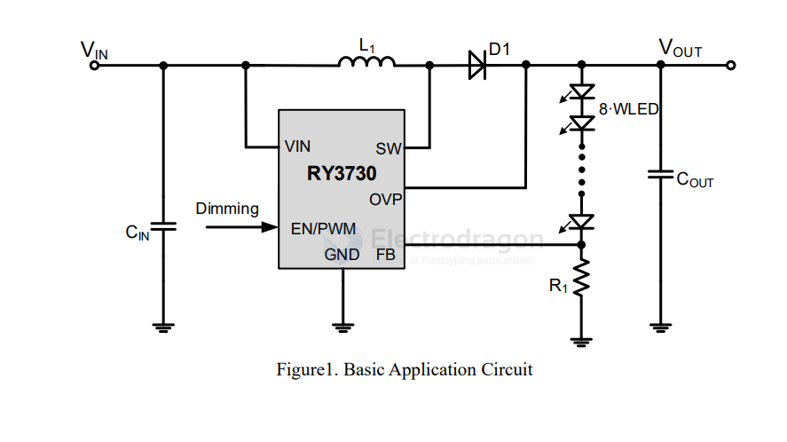

# rychip-dat

RY3730 - 1.2MHz, 30V Output, Step-Up WLED Driver

The Y3730 is a step-up converter designed for driving up to 8 Series white LED's from a single cell Lithium Ion
battery. Its low 250mV feedback voltage reduces power loss and improves efficiency

