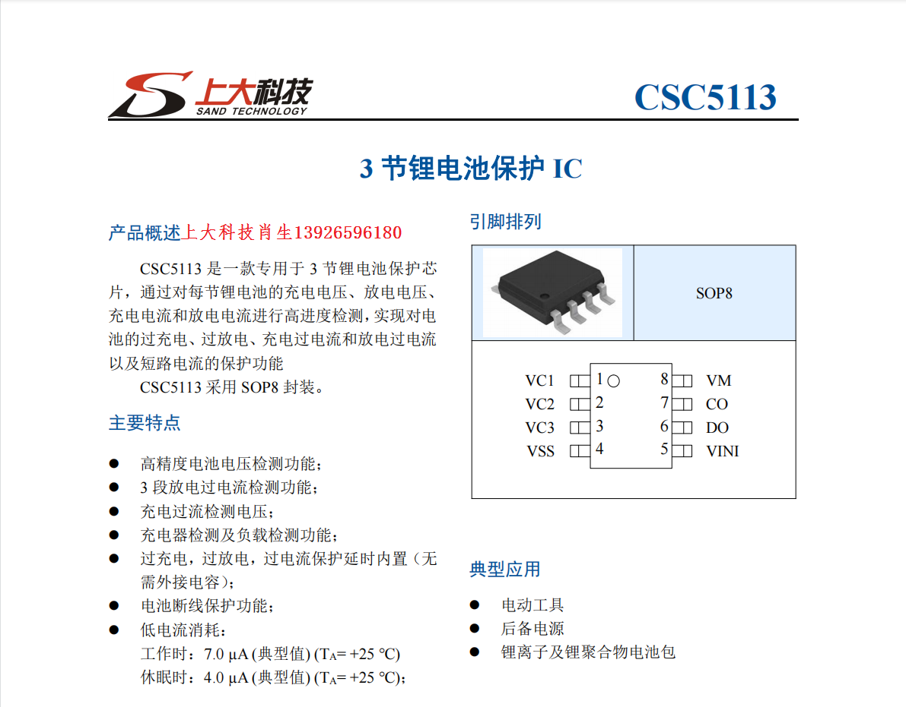

# CS5113-dat

- [[sand-tech-dat]] - [[CS5113-dat]] - [[battery-protector-dat]]

CSC5113 是一款专用于 3 节锂电池保护芯片，通过对每节锂电池的充电电压、放电电压、充电电流和放电电流进行高进度检测，实现对电池的过充电、过放电、充电过电流和放电过电流以及短路电流的保护功能。CSC5113 采用 SOP8 封装。

特点：高精度电池电压检测功能；3 段放电过电流检测功能；充电过流检测电压；充电器检测及负载检测功能；过充电，过放电，过电流保护延时内置（无

需外接电容）； 电池断线保护功能；低电流消耗：工作时：7.0 μA (典型值) (TA= +25 ℃)，休眠时：4.0 μA (典型值) (TA= +25 ℃)。

典型应用：电动工具，后备电源，锂离子及锂聚合物电池包。

电池保护板，顾名思义锂电池保护板主要是针对可充电（一般指锂电池）起保护作用的集成电路板。 锂电池（可充型）之所以需要保护，是由它本身特性决定的。由于锂电池本身的材料决定了它不能被过充、过放、过流、短路及超高温充放电，因此锂电池锂电组件总会跟着一块带采样电阻的保护板和一片电流保险器出现。

## ref 