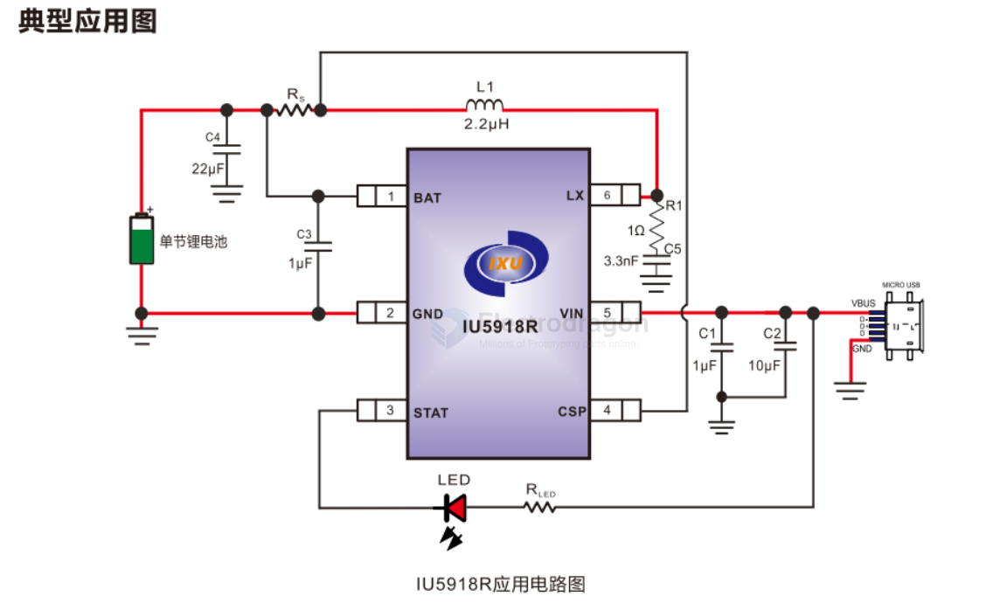
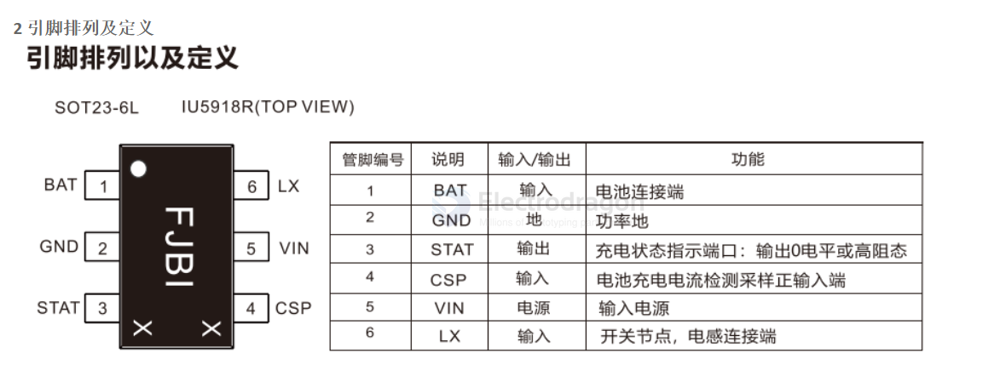

# IU5918-dat

- [[IU5918-dat]] - [[sand-tech-dat]] - [[battery-charger-dat]]

IU5918R是一款面向单节锂电池的同步降压充电管理IC，适配智能手机、移动手持设备等场景，采用SOT23-6L封装，输入电压3.5~7V，额定工作温度-40~85℃，最大充电电流2A且可通过外部电阻调节，集成功率MOS与同步开关架构，外围器件少，方案紧凑、BOM成本低。

核心性能优异：充电电压精度±1%，浮充电压典型值4.2V，支持涓流/恒流/恒压三阶段充电。电池电压<2.5V时以10%恒流充电，>2.5V时以设定恒流充电，电流降至10%恒流值时停充，电池电压<4.1V时自动复充；开关频率900KHz，输入自适应功能可智能调节充电电流，避免拉垮适配器，固定输入电压4.5V。

保护机制完善：具备输入欠压（3.5V阈值）、过压（8.47V阈值）保护，电池短路（1V阈值）、过压（4.6V阈值）保护；芯片温度升至120℃时启动调节，150℃触发热保护（40℃滞回）；充电超时保护（TC阶段14小时），故障解除后可恢复充电。

状态指示与应用配置：STAT管脚外接LED，充电时常亮、充满熄灭，异常（过压、短路、过温、超时）时2Hz闪烁；恒流充电电流通过检测电阻Rs设定，2A电流对应25mΩ电阻，需匹配电阻功率；电感选用2.2uH、饱和电流>2.6A、DCR<50mΩ的型号。

PCB布局需注意：输入输出电容选用22uF X5R/X7R陶瓷电容并靠近芯片；大电流路径走线短粗，LX走线优化以降低EMI；检测电阻Rs与电感连接直接且粗短，避免过孔跳线。整体为单节锂电设备提供高效、安全、小巧的降压充电解决方案。

一 IU5918的特性

同步降压充电

充电电流外部可调

+1%电池恒压精度

输入电流自适应功能,防止拉垮适配器输出

最大充电时间限制

内置功率MOS

充电状态指示

芯片过温保护,芯片温度自适应调节

输入欠压和过压保护

电池短路和过压保护

## ref 

