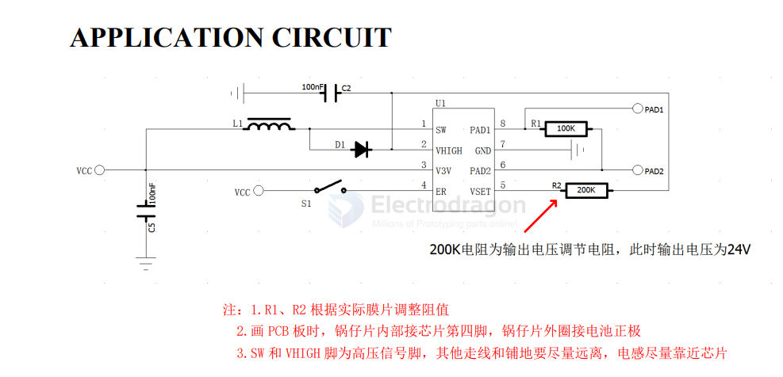

# WT161-dat

- [[writing-tablet-dat]] - [[semi-high-dat]] - [[WT161-dat]] 

DESCRIPTION

WT161是一款通用的手写板擦写自动控制芯片。

它采用3V纽扣电池或者两节或者三节普通干电池供电，自带升压电路，并每次自动产生1个极性相反的高压擦写脉冲，以达到一次性对手写板进行擦写的目的。

FEATURES
- 不擦写状态下基本零功耗（nA级别）
- 一键式自动擦写
- 自动升压
- 异性单脉冲
- 擦写脉冲电压可调（外置调压电阻）
- 最高输出电压可以达到50V

APPLICATIONS
- 手写板(Writing tablet)

## SCH 

## ref 

