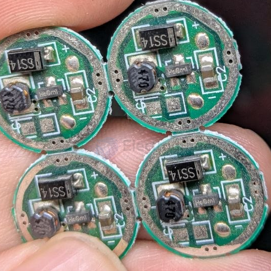
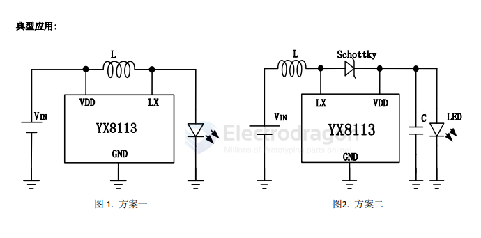
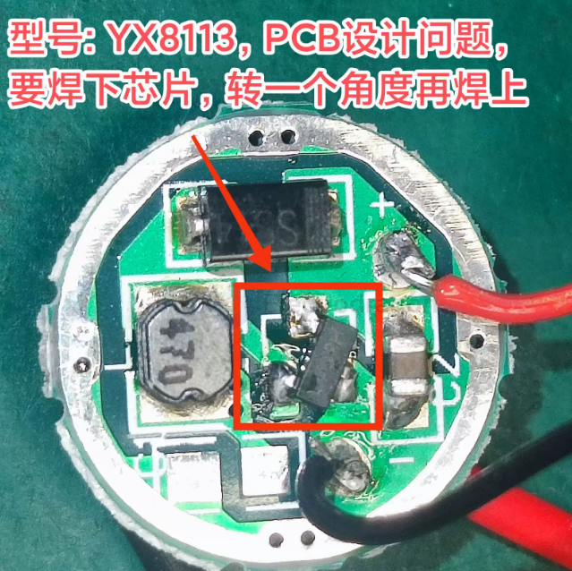
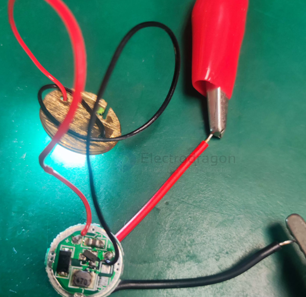

# YX8113-dat

- [[shiningic-dat]] - [[YX8113-dat]] - [[led-driver-dat]]

手电筒LED驱动IC

特性:
 低工作电压 0.9V ~ 1.8V
 高效率 80%以上
 1Ω 导通电阻

应用范围:
 移动手电筒
 LED 头灯
 LEDLED 照明装饰灯

chip marking code == He0mi

描述:

YX8113是我公司针对手电筒照明研发的LED驱动IC，主要用于一节电池0.9-1.8V充电电池或碱性电池。

YX8113是一款直流转换升压IC，采用CMOS工艺，高效率低功耗，外围简单，可驱动小功率LED。

YX8113 使用 SOT23 封装。

YX8113 可工作于-40℃~+85℃。

## SCH 

## board 

## ref 

