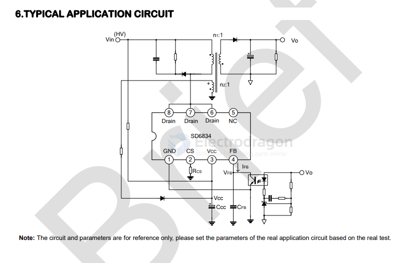

# silan-dat

- [[silan-dat]] - [[SD6834-dat]] - [[acdc-dat]]

CURRENT MODE PWM+PFM CONTROLLER WITH BUILT-IN HIGH VOLTAGE MOSFET

SD6834 is current mode PWM+PFM controller with built-in high-voltage MOSFET used for SMPS.

It features low standby power and low start current. In standby mode, the circuit enters burst mode to reduce the standby power dissipation. The switch frequency is 25~67kHz decided by the load with jitter frequency for low EMI.

Built-in peak current compensation circuit makes the limit peak current stable even with different input AC voltage. Maximum peak current compensation during power-on reduces pressure on transformer to avoid saturation, the peak current compensation will decrease for balance after power-on. Limit output current can be adjusted through the resistor connected to CS.

It integrates various protections such as undervoltage lockout, overvoltage protection, overload protection, leading edge blanking, primary winding overcurrent protection and thermal shutdown. The circuit will restart until normal if protection occurs.

## APP

- [[SD6834-datasheet.pdf]]

## build 