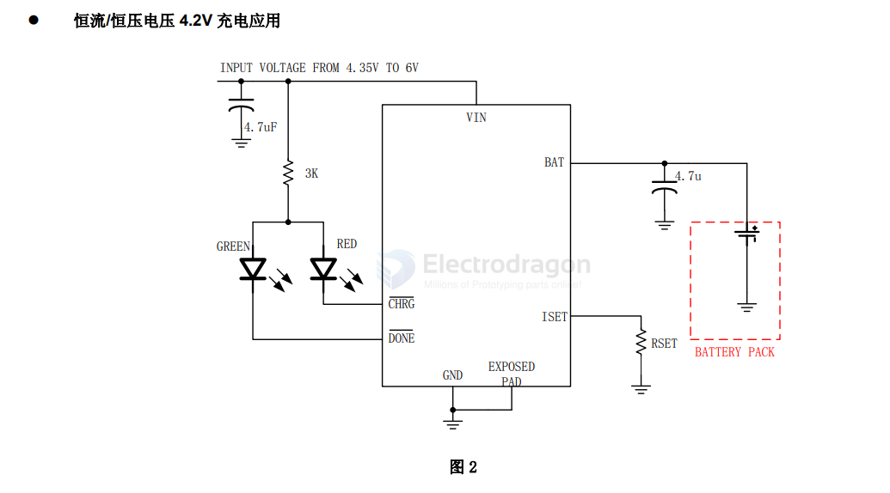
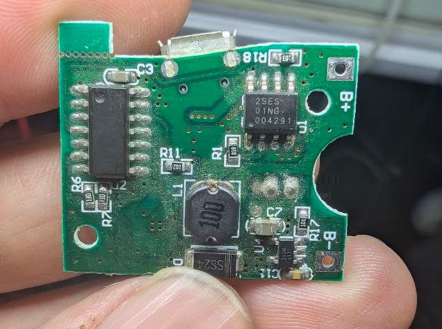
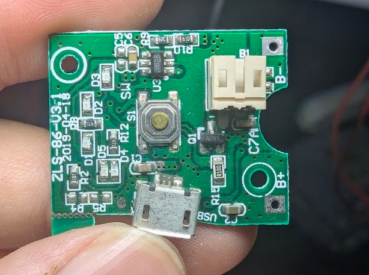

# XT2052-dat

- [[silinktek-dat]] - [[XT2052-dat]] - [[battery-charger-dat]]

1A Is Compatible With the USB Interface, Linear Battery Management Chip

- datasheet == [[XT2052_C.pdf]]

- [[XT2052-dat]] - [[battery-charger-1s-dat]] - [[silinktek-dat]] - [[natlinear-dat]]

## APP 

## build 

2SES 

B628 - [[SDB628-dat]] - [[shouding-dat]] - [[XT2052-dat]]

## ref 

