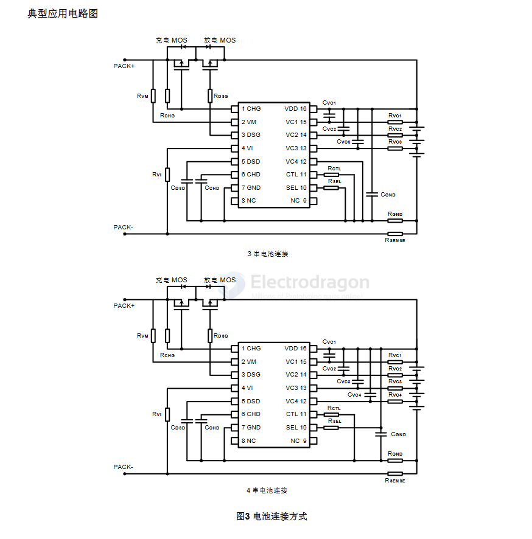

# sinowealth-dat

- [[battery-protector-dat]]

SH367003 3/4节电池串联用电池保护IC 特性 通过SEL端口实现3/4节电池串联应用切换 3档放电过流检测功能 高精度电压 (针对每节电池) 检测功能 高电压模式 (适用于液态锂离子电池/聚合物锂离子电池等) - 过充检测电压: 3.9V to 4.4V (档位间隔50mV) 精度: 0.05V to 0.3V (档位间隔50mV) 精度:.

SH36730X is a digital front-end acquisition chip designed for 3 to 16 string lithium battery packs with a built-in high-precision ADC.

- datasheet == [[SH367003-SinoWealthMicroelectronic.pdf]]

## SCH 

## ref 

