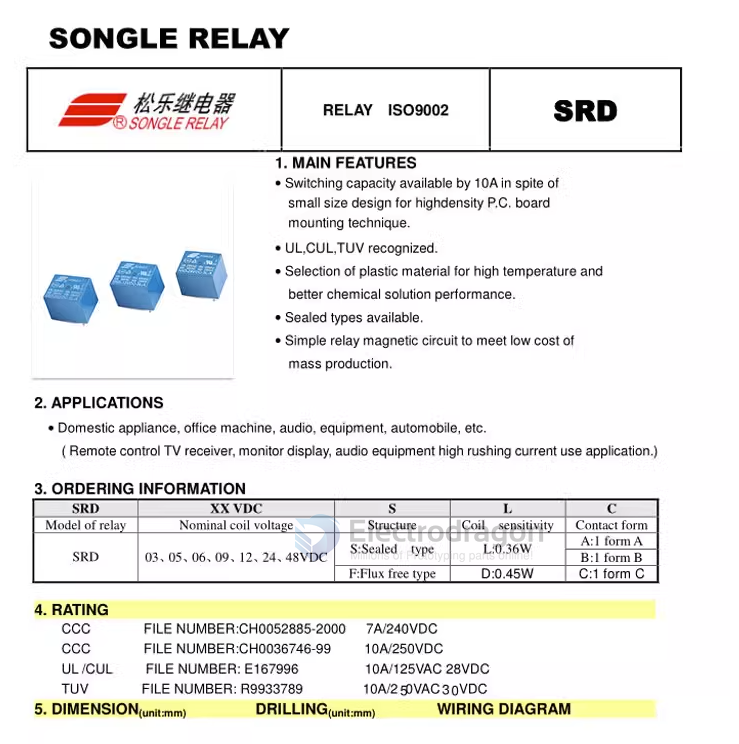
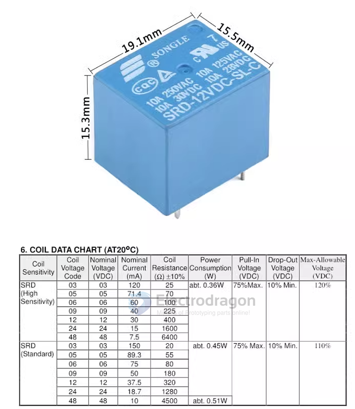
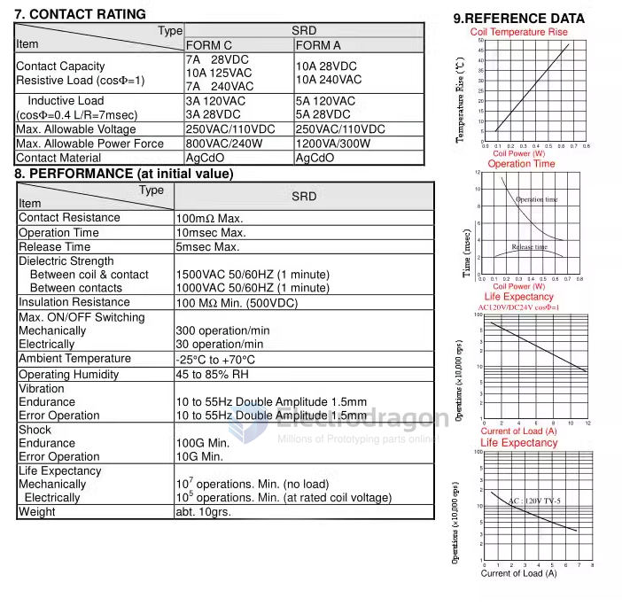
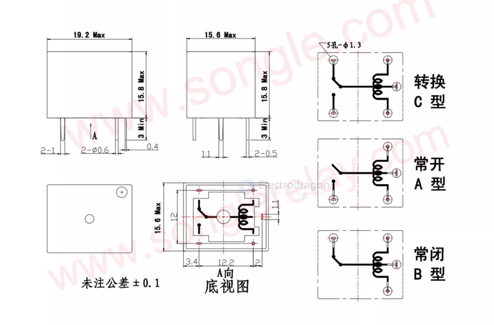
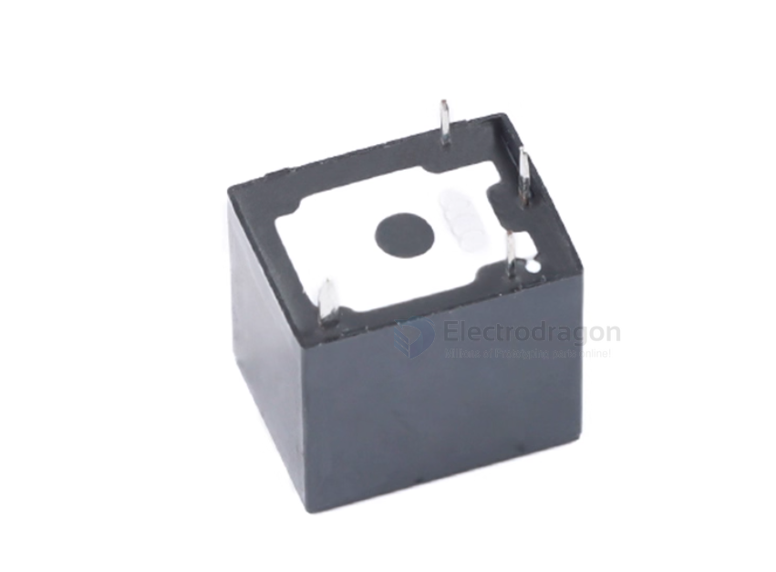
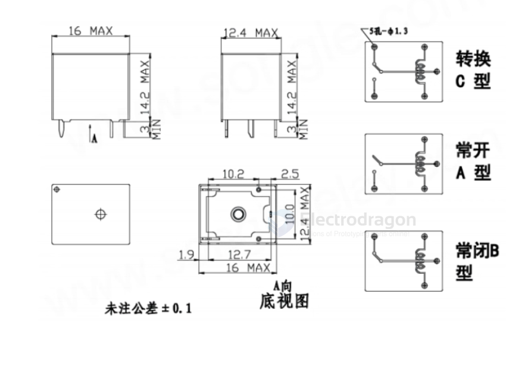

# songle-dat

- [[OPM1041-dat]] - [[OPM1042-dat]]

- [[SRD-songle-relay.PDF]

- [[SRA-songle-relay.PDF]]

SRD-12VDC-SL-A == S:Sealed / type L:0.36W / A:1 form A == 10A

form A == 4pin 

## SRA / SRD / SRU / SRS / SRC / SRSB relay

| Model               | Contact Configuration | Pins | Current |
|---------------------|----------------------|------|---------|
| SRA-05VDC-AL        | 1 NO                 | 4    | 20A     |
| SRA-12VDC-AL        | 1 NO                 | 4    | 20A     |
| SRA-24VDC-AL        | 1 NO                 | 4    | 20A     |
| SRA-05VDC-CL        | 1 NO 1 NC            | 5    | 20A     |
| SRA-12VDC-CL        | 1 NO 1 NC            | 5    | 20A     |
| SRA-24VDC-CL        | 1 NO 1 NC            | 5    | 20A     |
| SRD-05VDC-SL-A      | 1 NO                 | 4    | 10A     |
| SRD-12VDC-SL-A      | 1 NO                 | 4    | 10A     |
| SRD-24VDC-SL-A      | 1 NO                 | 4    | 10A     |
| SRD-05VDC-SL-C      | 1 NO 1 NC            | 5    | 10A     |
| SRD-12VDC-SL-C      | 1 NO 1 NC            | 5    | 10A     |
| SRD-24VDC-SL-C      | 1 NO 1 NC            | 5    | 10A     |
| SRU-12VDC-SL-A      | 1 NO                 | 4    | 10A     |
| SRU-12VDC-SL-C      | 1 NO 1 NC            | 5    | 10A     |
| SRU-24VDC-SL-C      | 1 NO 1 NC            | 5    | 10A     |
| SRS-05VDC-SL        | 1 NO 1 NC            | 6    | 3A      |
| SRS-12VDC-SL        | 1 NO 1 NC            | 6    | 3A      |
| SRS-24VDC-SL        | 1 NO 1 NC            | 6    | 3A      |
| SRC-12VDC-SH        | 2 NO 2 NC            | 8    | 1A      |
| SRSB-12VDC-SL-A     | 1 NO                 | 4    | 5A      |
| SRSB-24VDC-SL-A     | 1 NO                 | 4    | 5A      |

## OPM1041 

- [[OPM1041-dat]]

## ref

- [[relay-dat]]

## T73

## SRA 

SRA-05V/12V/24VDC-AL 

