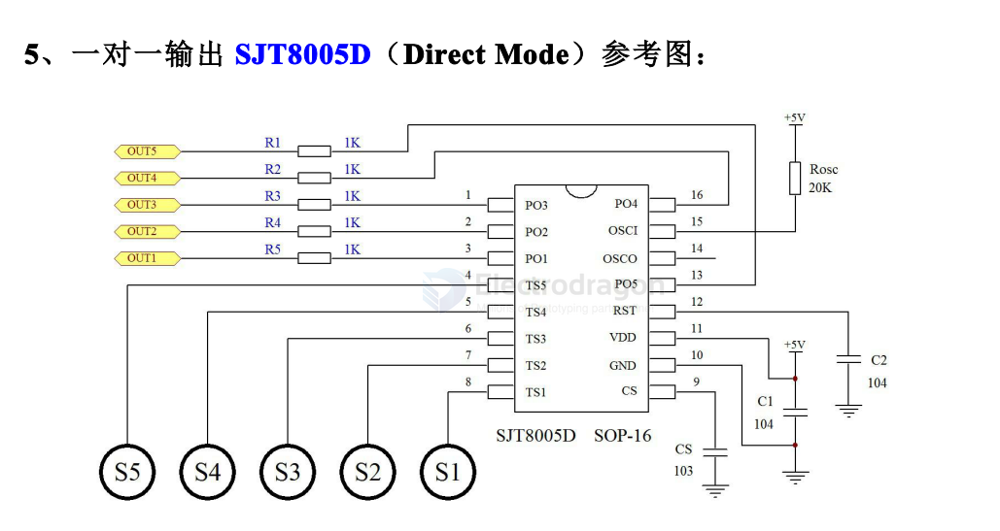
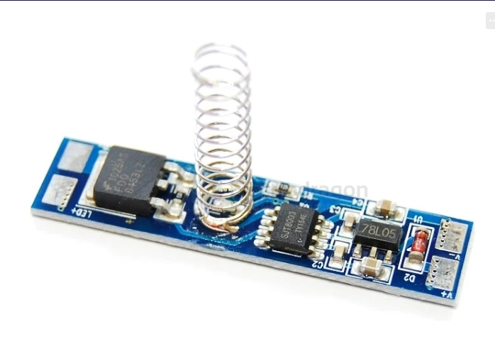

# soujet-dat

- [[SJT83-dat]] - [[soujet-dat]] - [[touch-pad-dat]]

SJT8003 / SJT8005 

- 5 个电容式触摸感应按键
- 工作电压：2.5V～5.5V
- 功率消耗：VDD=5V 无负载工作电流 550uA，待机电流 6uA
- 按键灵敏度可由外部电容自由调节
- 提供一对一、BCD 编码、 高阻(OD)等输出方式和 I²C 通讯方式
- 触摸生效“哔”声提醒功能
- 环境温度湿度变化自动适应功能
- 抗电源干扰和手机干扰能力强

one to one diagragm sch 

SJT8005DH：上电初始化，输出端为低电平，触摸生效时输出高电平；
SJT8005DL：上电初始化，输出端为高电平，触摸生效时输出低电平；
SJT8005DS：上电初始化，输出端为低电平，触摸一次输出端的状态翻转一次。
SJT8005DL_OD：上电初始化，输出端为高阻状态，触摸生效时输出低电平。

应用范围：

家用电器、消费类电子产品、安防和楼宇产品、医疗保健产品、手持装置、工业控制、照明产品、玩具以及计算机周边等等。用于取代薄膜、按钮以及普通开关。

## control 

Use a special light tuning IC SJT83, supports two ways of controlling:
- press once to turn ON, hold for speedless tuning light from low to high, press once to turn off
- press once to turn ON, hold for speedless tuning light from high to low, press once to turn off
- press once to turn ON, press each three times for low, medium, high light intensity, press once to turn off
- press once to turn ON, press each three times for low, medium, high light intensity, press once to turn off

Chip function simply based on mosfet output control, it is a pre-programmed chip.

| pin 1 | pin 8 | pin 6 | function                     |                                                                                         |
| ----- | ----- | ----- | ---------------------------- | --------------------------------------------------------------------------------------- |
| +     | +     | +     | stepless speed control       | Sudden change, single-button single-output stepless dimming without brightness memory   |
| -     | +     | +     | stepless speed control w/mem | Sudden change, single-button single-output stepless dimming with brightness memory      |
| +     | -     | -     | three phase control L-to-H   | LED three-stage dimming, sequence: low brightness-medium brightness-high brightness-OFF |
| -     | -     | -     | three phase control H-to-L   | LED three-stage dimming, sequence: high brightness-medium brightness-low brightness-OFF |

## board 

- [[USB1000-dat]] - [[ILC1063-dat]]

## ref 