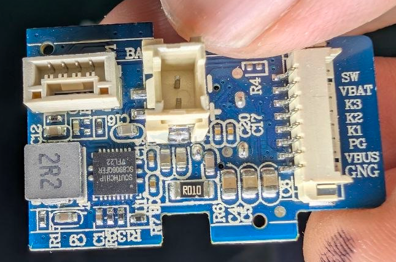

# SC8906-dat

- [[dcdc-boost-down-dat]] - [[SC8906-dat]] - [[southchip-dat]] - [[DCDC-dat]]

relevant chip == [[HUSB238-dat]]，[[ASC5613-dat]]

https://pese.oss-cn-shenzhen.aliyuncs.com/pdfs/2009090933_Southchip-Semicon-SC8906QFER_C506249.pdf

SC8906 High Efficiency, Synchronous, Buck-Boost Charger Converter with Four Integrated MOSFET

SC8906 is a synchronous buck-boost charger converter.

Four switches are integrated to simplify the system design. 

SC8906 employs current-mode control and can support very wide input and output voltage range. It can support applications from 2.7V to 22V VBUS range. It is able to effectively manage charging for 2~4 cell batteries no matter input/output voltage is higher, lower or equal to battery voltage.

SC8906 supports input current limit, DPM (dynamic power management) function, and fast charging detecting. Charging voltage and current limit can be adjusted by external resistor.

SC8906 supports internal current limit, under voltage protection, over voltage protection, output short protection and over temperature protections to ensure safety under abnormal conditions.

The IC is in a 21 pin 4x4 QFN package

## ref 

