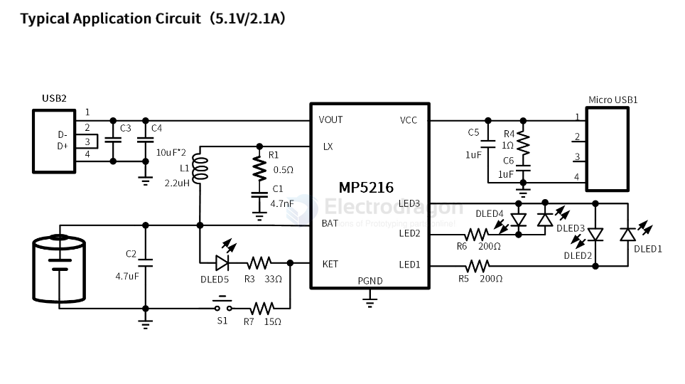
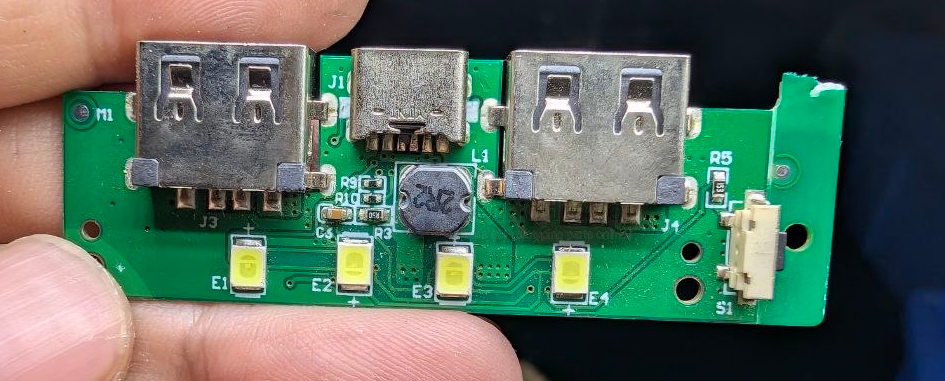
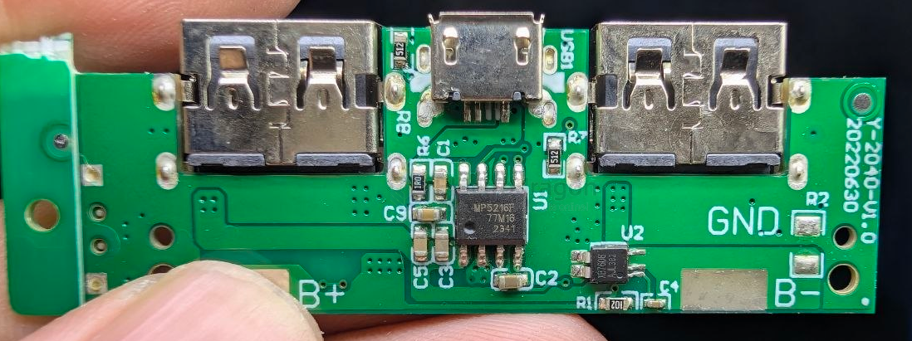

# MP5216-dat

- [[tkplusemi-dat]] - [[MP5216-dat]] - [[power-bank-dat]]

MP5216 is a power bank solution device which is highly integrated with switch charger, LEDdisplay cell and synchronous boost output.

The MP5216 has two operating modes, charge mode and boost mode, to manage the system and battery power based on the state of the input.

When input power is present, the MP5216 operates in charge mode. It automatically detects the battery voltage and charges the battery in the three phases: trickle current mode, constant current mode and constant voltage mode.

Boost will be enabled by pressing the KEY or insertion a load at standby mode when the battery voltage is higher than 3.2V.

- [[MP5216-datasheet.pdf]]

## APP 

## build 

- [[XB7608-dat]] - [[xysemi-dat]]

## ref 

