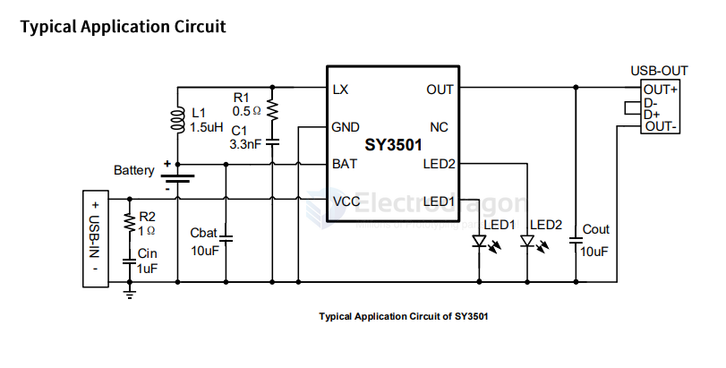

# SY3501-dat

- [[SY3501-dat]] - [[tkplusemi-dat]] - [[power-bank-dat]]

Single Chip IC For Portable Power Sources

SY3501 is a single-chip IC specially designed for portable power sources, highly integratingchargingmodule,LEDbattery display cell and synchronous boost output, minimizingtheperipheralcircuitsand components.and providingthesimplest,low- costsolutionforpowerbank applications such as large-capacity single-cell or multi-cell connectedlithiumbattery(lithiumionor lithium polymer).SY3501isavailableina ESOP8package.

Applications

- Mobile devices such as mobile phones,tabletPCs,GPS,and electrictools
- Standbypower

## SCH 

