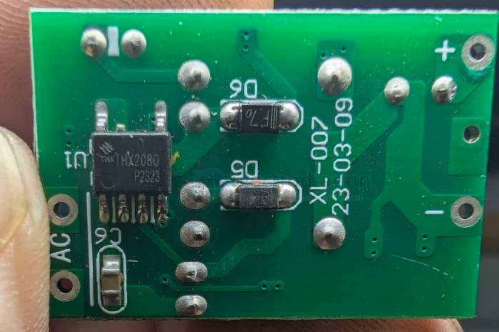
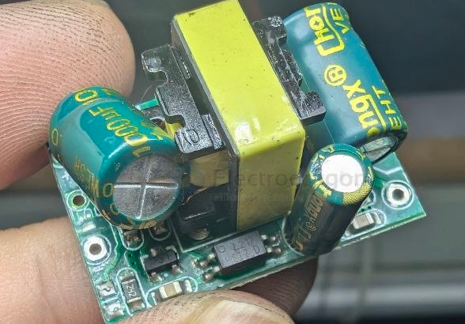
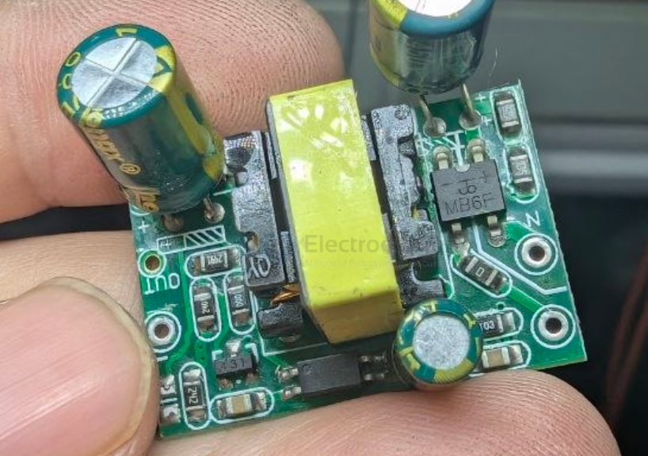
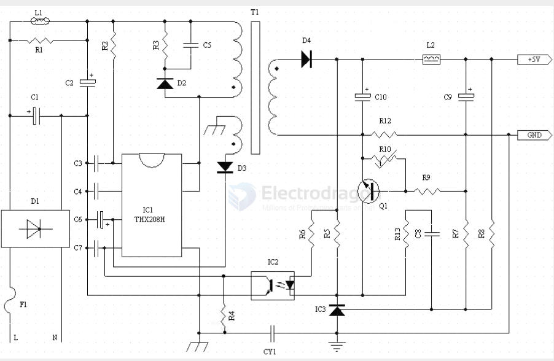

# THX208-dat

- [[THX208-dat]] - [[tonghuaxin-dat]] - [[OPM1016-dat]] - [[acdc-dat]]

## build 

- [[diode-dat]] == L217

- [[TL431-dat]] 

- [[THX208-dat]] - [[transformer-dat]] - [[rectifier-dat]] == MB6F

- [[transistor-dat]] == 2N3096 

## SCH 

## ref 

- [[THX208-DS.pdf]]
