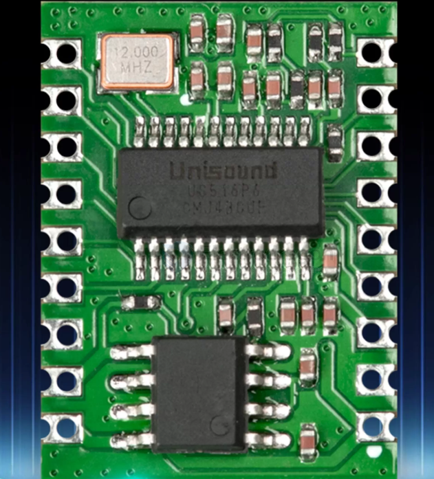
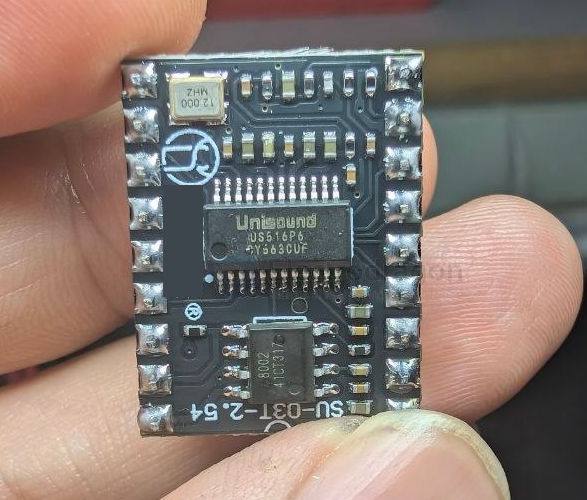
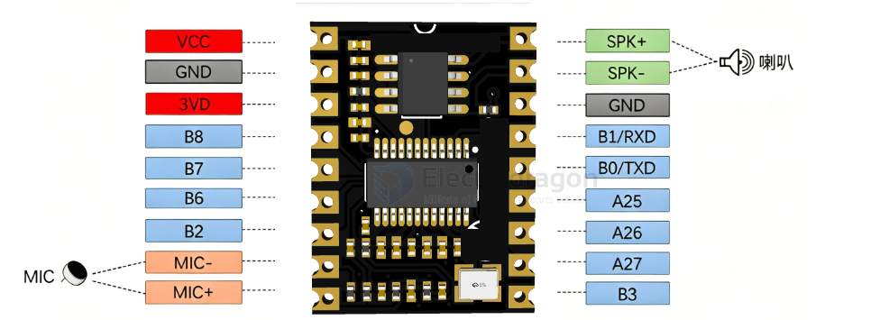
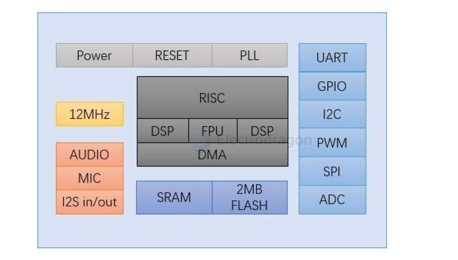
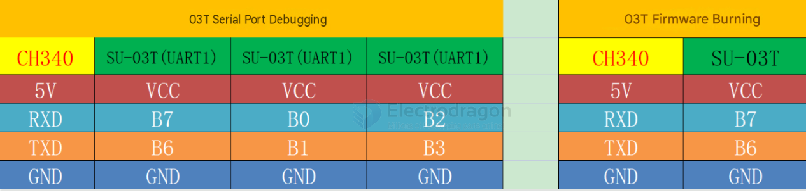
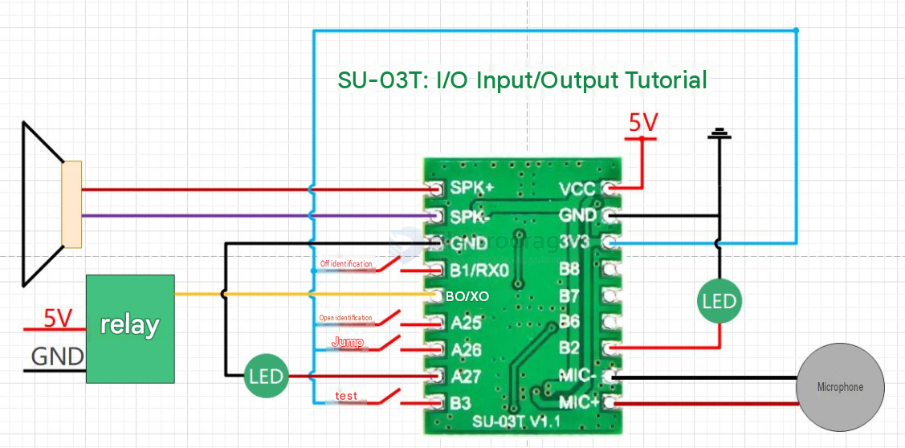
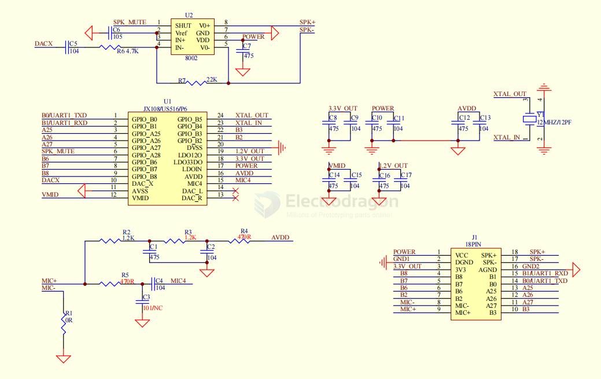

# US516P6-dat

- [[unisound-dat]] - [[US516P6-dat]] - [[voice-detection-dat]]

`US516P6` is a fully offline AI voice recognition module, powered by the `Unisound` voice processing chip. It enables voice command recognition, control output, and voice playback without an internet connection. The module features a 2.54mm standard pitch design with castellation holes for easy embedding into systems. It can interface directly with STM32, Arduino, 8051 MCU, and other embedded platforms, widely used in smart home, appliance control, industrial equipment, toys, and other voice-interaction scenarios.

- [[SDK-dat]] - [[SDK-unisound-dat]]

SU-03T 语音识别模块

- [[unisound-dat]] - [[US516P6-dat]]

## Board

## diagram 

## specs 

-  32bit RISC 内核，运行频率 240M
-  支持 DSP 指令集以及 FPU 浮点运算单元
-  FFT 加速器：最大支持 1024 点复数 FFT/IFFT 运算，或者是 2048 点的 实 数 FFT/IFFT 运算
-  内置高速 SRAM，内置 2MB FLASH
-  内置 3W、单声道 AB 类功放
-  支持 1 路驻极体麦
-  支 持 I2S input/output
-  支持 5V 电源输入
-  内置 5V 转 3.3V，3.3V 外部负载不超过 150mA
-  RC 12MHz 时 钟 源 和 PLL 锁相环时钟源
-  内 置 POR（Power on Reset），低电压检测和看门狗
-  所 有 GPIO 均可配置为外部中断输入和唤醒源
-  1 个标准 SPI Master 接口，最高速率 30MHz
-  1 个 SPI Slave 接口最高速率 30MHz
-  1 个全双工 UART 最高速率 3Mbps。
-  1 个 I2C 主/从控制器最高速率 400kHz
-  2 个 PWM 输出
-  1 个 12-bit SAR-ADC 最大 450Khz 采样率

## Wiring

| No. | Pin Name | Function                                               |
| --- | -------- | ------------------------------------------------------ |
| 1   | VCC      | 5V power supply                                        |
| 2   | GND      | Digital ground                                         |
| 3   | 3V3      | Internal LDO 3.3V output, external load max 150mA      |
| 4   | B8       | Debug print pin, can be left floating                  |
| 5   | B7       | ADC13/UART1_TXD/I2C_SCL                                |
| 6   | B6       | ADC12/UART1_RXD/I2C_SDA                                |
| 7   | B2       | UART1_TXD/I2C_SCL/TIM3_PWM                             |
| 8   | MIC-     | Electret microphone negative                           |
| 9   | MIC+     | Electret microphone positive                           |
| 10  | B3       | UART1_RXD/I2C_SDA/TIM4_PWM                             |
| 11  | A27      | ADC6/SPIS_MOSI/SPIM_MOSI/I2S0_DO/DMIC1_CLK/TIM3_PWM    |
| 12  | A26      | ADC5/SPIS_CLK/SPIM_CLK/I2S0_BCLK/I2S1_BCLK/DMIC0_CLK   |
| 13  | A25      | ADC4/SPIS_MISO/SPIM_MISO/I2S0_LRCLK/I2S1_LRCLK/DMIC_DAT|
| 14  | B0       | UART0_TXD/I2C_SCL/TIM3_PWM                             |
| 15  | B1       | UART0_RXD/I2C_SDA/TIM4_PWM                             |
| 16  | GND      | Digital ground                                         |
| 17  | SPK-     | Speaker negative                                       |
| 18  | SPK+     | Speaker positive                                       |

注意：UART0 串口 B0,B1 引脚是调试器的烧录口，串口烧录使用 UART1（B6，B7 脚），具体烧录方式查看烧录文档。

test circuit 

## SCH

- [[8002-dat]] - [[unisound-dat]] - [[US516P6-dat]] - [[ASR-PRO-dat]] - [[voice-detection-dat]] - [[audio-dat]]

## QA — Common Issues

> SU-03T offline voice recognition module, core chip: UCS51AP6

### 1. Module unresponsive / No voice recognition (Most common)

**Symptoms:** No response to voice commands, no serial data, no reaction on power-up.

**Root Causes:**

1. **Insufficient/unstable power supply** — Peak current can reach 150mA. Drawing power directly from a 3.3V MCU pin causes voltage drop (<3.0V triggers brown-out reset). USB-to-serial converters may also lack sufficient current.
2. **Microphone wiring error / phase reversal** — MIC+/MIC- reversed, or cold solder / damaged microphone.
3. **Faulty firmware** — Flash a known-working demo to verify.

---

### 2. Hissing / Noise during voice playback

**Symptoms:** Audible hiss, static noise, distorted playback.

**Root Causes:**

1. **Power interference** — Module shares supply with motors/servos; switching noise couples into the audio circuit.
2. **Amplifier circuit fault** — Abnormal voltage on SPK+/SPK- (normal: 2.2–2.5V; if 5V or 0V, the amplifier is damaged).
3. **Wiring interference** — Audio lines routed parallel to power lines, causing electromagnetic crosstalk.

---

### 3. Module randomly resets / freezes

**Symptoms:** Suddenly stops responding during normal operation; requires power cycle to recover.

**Root Causes:**

1. **Power supply fluctuation** — Instantaneous voltage drop triggers reset.
2. **Serial communication noise** — Corrupted data causes program crash.
3. **ESD damage** — Internal chip destroyed by electrostatic discharge.

**Solutions:**

1. Add filter capacitor between 5V and GND to stabilize voltage.
2. Add 1kΩ pull-up resistors on serial lines; shorten signal trace length.
3. Discharge static before handling; avoid touching chip pins.

---

### 4. No response to serial commands

**Symptoms:** No voice output and no return data after sending serial commands.

**Root Causes:**

1. **Wrong command format** — SU-03T requires strict `AA 55 ... 55 AA` frame format. Header, length, or checksum errors cause the module to ignore the packet.
2. **Baud rate mismatch** — Default is 9600 bps; MCU baud rate may be misconfigured.
3. **TX/RX wiring error** — Module TX connected to MCU TX and RX to RX (no crossover).
4. **Serial buffer overflow** — MCU fails to read data in time, causing packet loss.

**Solutions:**

1. Send commands strictly per protocol; calculate checksum correctly.
2. Use unified 9600 baud, 8N1 format.
3. Cross-connect: Module TX → MCU RX, Module RX → MCU TX, share GND.
4. Optimize serial interrupt handling; clear buffer promptly.

---

### 5. Serial data garbled / CRC errors

**Symptoms:** Received serial data is all garbled; checksum fails.

**Root Causes:**

1. **Baud rate mismatch or crystal tolerance** — Clock deviation causes bit errors.
2. **Voltage level mismatch** — 5V MCU directly connected to 3.3V module; over-voltage damages the module.
3. **EMI / long signal lines** — Signal reflection on long traces.

**Solutions:**

1. Verify the crystal oscillator; replace with a higher-precision one if needed.
2. Use a level shifter between 5V MCU and 3.3V module.
3. Add 22Ω series damping resistors; keep signal lines under 20cm.

## Ref

doc - https://help.aimachip.com/docs/offline_su03t/su_03t_kfb

