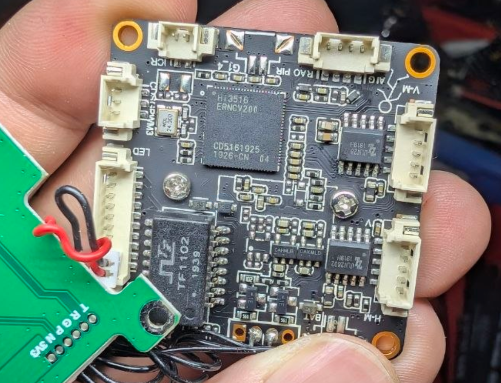
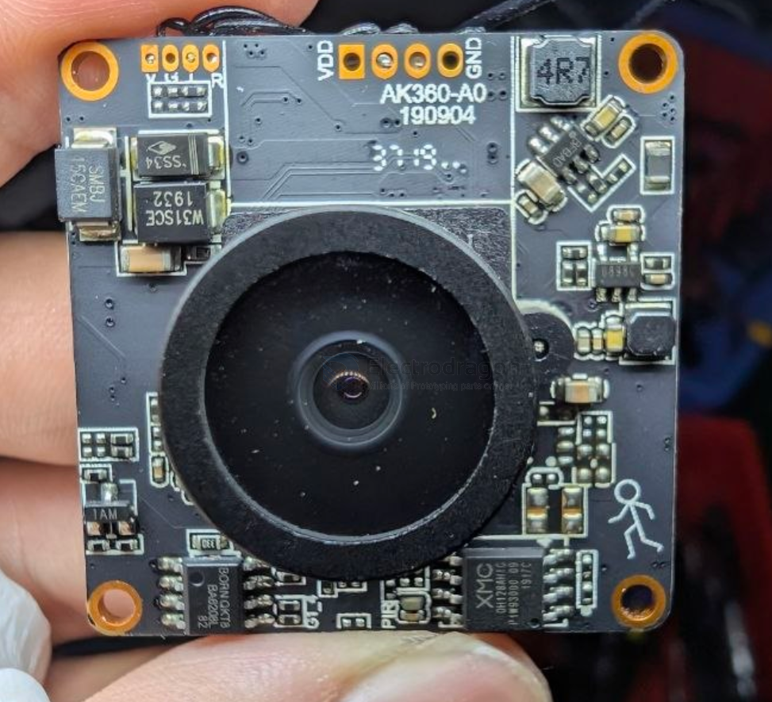

# IVG-G2S-dat

- [[xiongmai-dat]] - [[IVG-G2S-dat]] - [[chip-cn-dat]] - [[hi3516-dat]] - [[IMX307-dat]]

IVG-G2S == https://www.xiongmaitech.com/en/index.php/product/product-detail/204/227/456

https://github.com/OpenIPC/sandbox-fpv/blob/master/notes_start_ivg-g2s.md

- [[IVG-G2S_Interface_Description.pdf]]

### build 2 

- [[HI3516-dat]] - [[FC-build-CN-dat]] - [[flight-controller-dat]]

back 

- [[VTX-openIPC-dat]] - [[VTX-dat]] - [[HI3516-dat]]

- [[TF1102-dat]] - [[ethernet-dat]]

- [[ULN2802-dat]] - [[ULN2803-dat]] - [[Darlington-transistor-array-dat]]

- [[LDO-dat]] - CAHMLB - CAXMLD

front 

- [[unisonic-dat]] - [[BA6208-dat]]

REVERSIBLE MOTOR DRIVER

The BA6208L is a reversible motor driver integrated circuit (IC) manufactured by Unisonic Technologies, commonly used in cassette players and other electronic equipment.

- [[flash-nor-dat]] - [[XMC-dat]] - [[XM25QH128C-dat]] - [[hi3516-dat]] == 
128Mbit

BFBAD - [[bfsemi-dat]] - [[dcdc-dat]]

0898c sot23-5 - [[dcdc-dat]]

## ref 