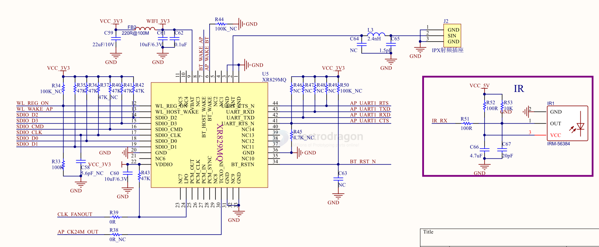

# XR829-dat

http://www.xradiotech.com/product/XR829.php

XR829
- Compatible with IEEE 802.11 b/g/n standard
- Bluetooth v2.1+EDR/4.0
- SDIO 2.0 host interface
- HCI using a HS UART and PCM for audio data
- Internal RF impedance matching network
- On-chip auto calibrations
- 5x5mm 40pin QFN

SCH 

## ref 

- [[xradiotech-dat]]