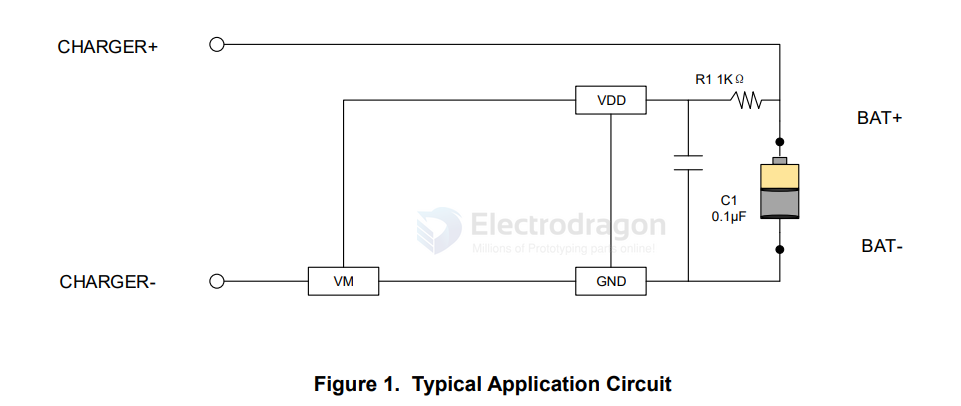

# XB4908-dat

- [[battery-protector-1s-dat]] - [[xysemi-dat]] - [[XB8089-dat]] - [[XB4908-dat]] 

https://yzvideo-c.yizimg.com/398592/2025521-165926252.pdf

The XB4908 SERIES product is a high integration solution for lithium-ion/polymerbattery protection. XB4908 SERIES contains advanced power MOSFET, high-accuracy voltage detection circuits and delay circuits. XB4908 SERIES is put into an ultra-small ESN4 package and only one externalcomponent makes it an ideal solution in limited space of battery pack.

XB4908 SERIES has all the protection functions required in the battery application including overcharging, over-discharging, overcurrent and load short circuiting protection etc. The accurate overcharging detection voltage ensures safe and full utilization charging. The low standby current drains little current from the cell while in storage.

The device is not only targeted for digital cellular phones, but also for any other Li-Ion and Li-Poly battery-powered information appliances requiring long-term battery life

## ref 