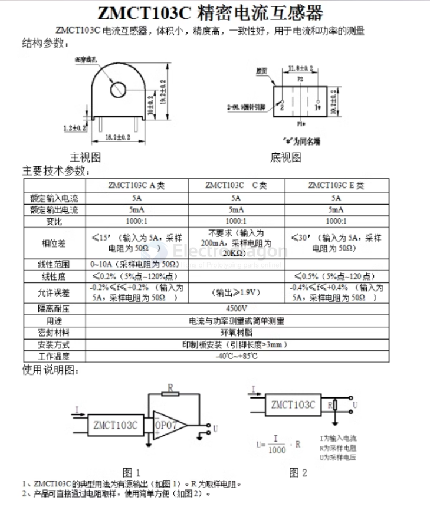
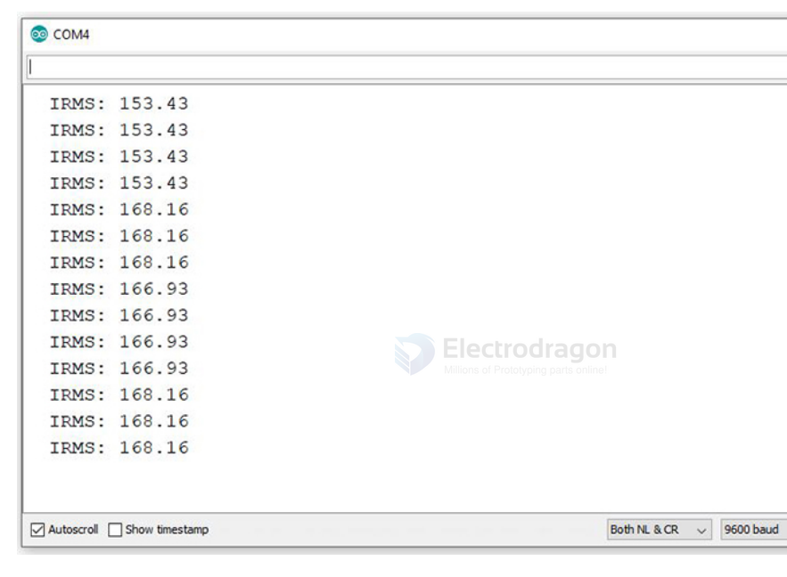

# ZMCT103-dat

ZMCT103C == current transformer

- Model: ZMCT103C
- Brand: ZM
- Package: DIP
- Packaging: Boxed
- Quality: 100% brand new, original and genuine

Note: Ratio 1000:1 

## Arduino Analog A0 Read 

    #define calibration_const 355.55

    int max_val;
    int new_val;
    int old_val = 0;
    float rms;
    float IRMS;

    void setup() {
        pinMode(A0,INPUT);
        Serial.begin(9600);
    }

    void loop() {
        new_val = analogRead(A0);

        if(new_val > old_val) {
            old_val = new_val;
        }
    
        else {
            delayMicroseconds(50);
            new_val = analogRead(A0);

            if(new_val < old_val) {
                max_val = old_val;
                old_val = 0;
            }
            
            rms = max_val * 5.00 * 0.707 / 1024;
            IRMS = rms * calibration_const;
            
            Serial.print("  IRMS: ");
            Serial.println(IRMS);
            
            delay(1000);
        }
    }

Values are in terms of mA.

## ref 

- [[zeming-dat]]