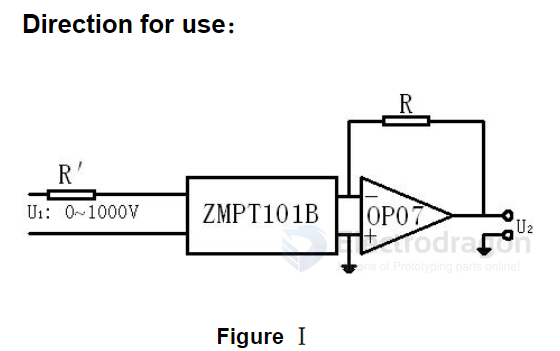
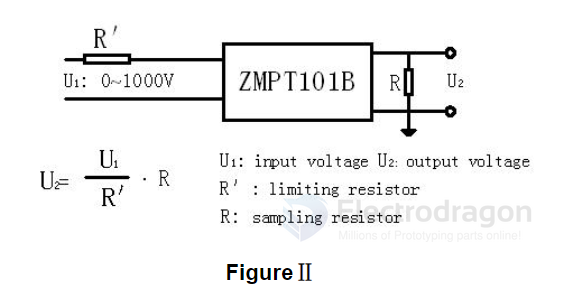

# ZMPT101-dat

Current-type Voltage TransformerSmall 

size，high accuracy, good consistency, for voltage and power measurement

## APP

Figure I 

The typical usage of the product is for the active output (FigureI). 

R ＇is a limiting resistor

R is a sampling resistor = sampling resistor 100Ω

    0~1000V 0~10mA （ sampling resistor 100Ω ）

Figure II 

The product can be directly through the resistance sampling , easy to use ( FigureII).

## ref 

- [[zeming-dat]]

- [[ZMPT101B specification.pdf]]