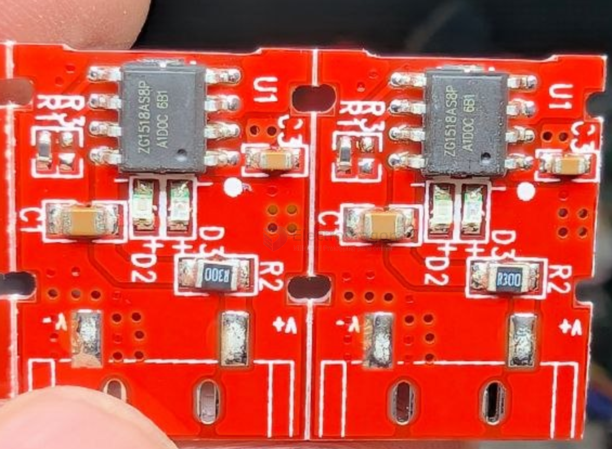

# zhenyang-dat

ZG1518A  一款完整的单节锂离子电池充电器，带电池正负极反接保护，采用恒定电流/恒定电压线性控制。只需较少的外部元件数目使便携式应用的理想选择。ZG1518A 可以适合 USB 电源和适配器电源工作。

由于采用了内部 PMOSFET 架构，加上防倒充电路，所以不需要外部检测电阻器和隔离二极管。热反馈可对充电电流进行自动调节，以便在大功率操作或高环境温度条件下对芯片温度加以限制。充满电压固定于 4.25V，而充电电流可通过一个电阻器进行外部设置。当电池达到 4.25V 之后，充电电流降至设定值 1/10，ZG1518A 将自动终止充电。当输入电压（交流适配器或 USB 电源）被拿掉时，ZG1518A 自动进入一个低电流状态漏电流3uA 以下。ZG1518A 的其他特点包括充电电流监控 器、欠压闭锁、自动再充电和两个用于指示充电结束和输入电压接入的状态引脚。

功能特点

- 预设 4.25V±0.035V 空载/饱和电压（FT TRIM 技术实现）
- 输入电压：10V
- VIN=0 进入待机模式，待机电流<3uA.
- 具有 BAT-VIN 防倒灌功能
- 支持对 0V 电池充电。
- 线性充电模式，内置 1A MOSFET，支持对 0V 电池充电，涓流/恒流/恒压三段式充电，充电电流外部可调；
- 短路保护功能
- 锂电池正负极反接保护
- 智能温控技术，充电电流会随温度升高而降低，130 度开始下降，***可降至 0。
- 软启动限制了浪涌电流
- 可直接从 USB 端口给单节锂离子电池充电；
- 自动再充电；
- 内置充电电流会随温度升高而降低， 130 度开始下降，***可降至 0；
- 支持 1 灯模式和两灯模式；
- 4KV ESD

## ref 