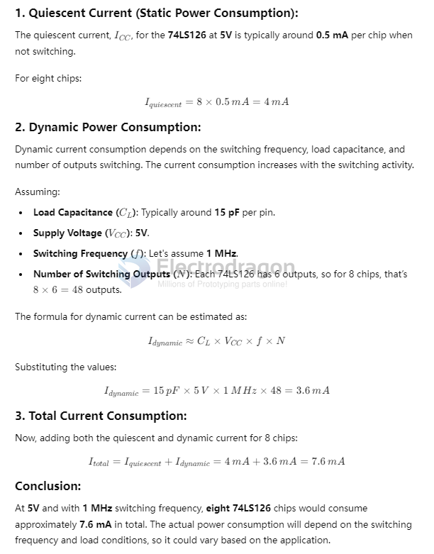

# 74HC126-dat

PISO = 74HC165 = 0.04 - SOIC 16 - Package_SO:SOIC-16_3.9x9.9mm_P1.27mm - SOIC-16 - Nexperia(安世)

QUADRUPLE 3-STATE BUFFERS OE HIGH 

## power consumption 

+5V, 8x chips maximally usage: 

