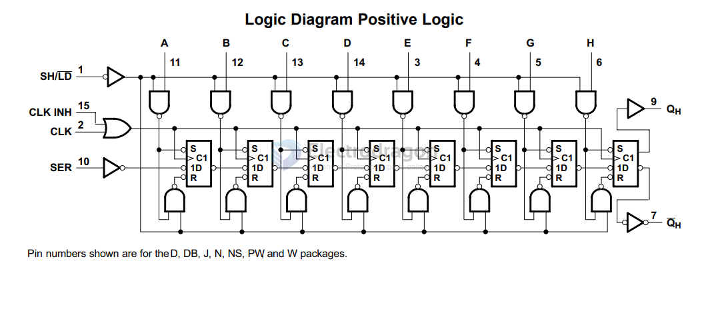

# 74HC165-dat

## logic map 

## pin definitions 

input control pins 
- 1: SH/LD
- 2: CLK

and 
- 15: optional CLK INH
- 10: optional SER 

input data pins:
- A
- B
- C
- D
- E
- F
- G
- H

output pins 
- 7: _QH
- 9: QH

## demo code 

code 1 
- this one may not working, due to need specified library, [[74HC165-rpi-1.py]]
- copy from https://forums.raspberrypi.com/viewtopic.php?t=254053

code 2 
- based on circuitpython
- [[74HC165-rpi-2.py]] 
- https://github.com/WoolseyWorkshop/WoolseyWorkshop_CircuitPython_74HC165

- [[rpi-python-dat]]

## ref 

- [[74xx-dat]]

- DS - 