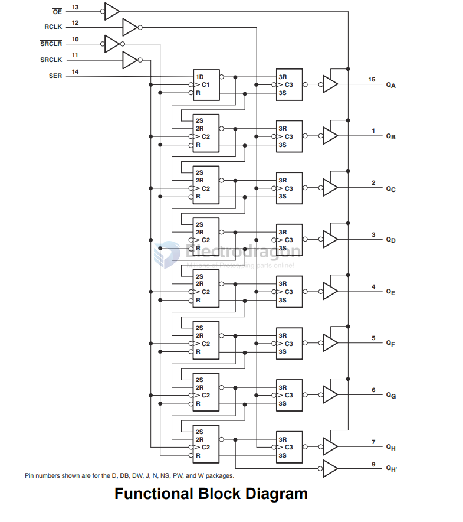
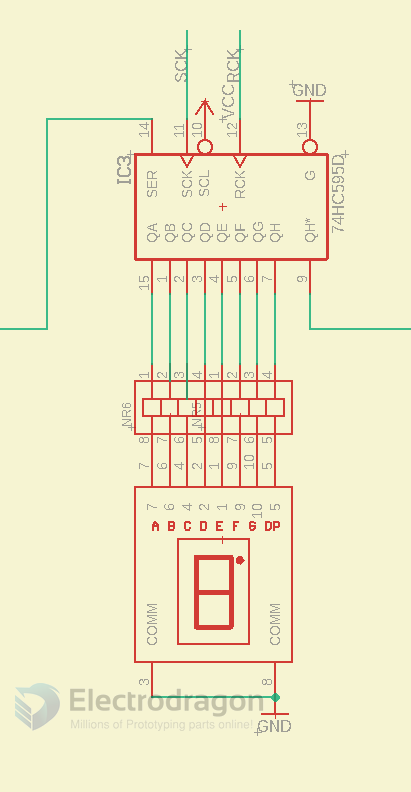
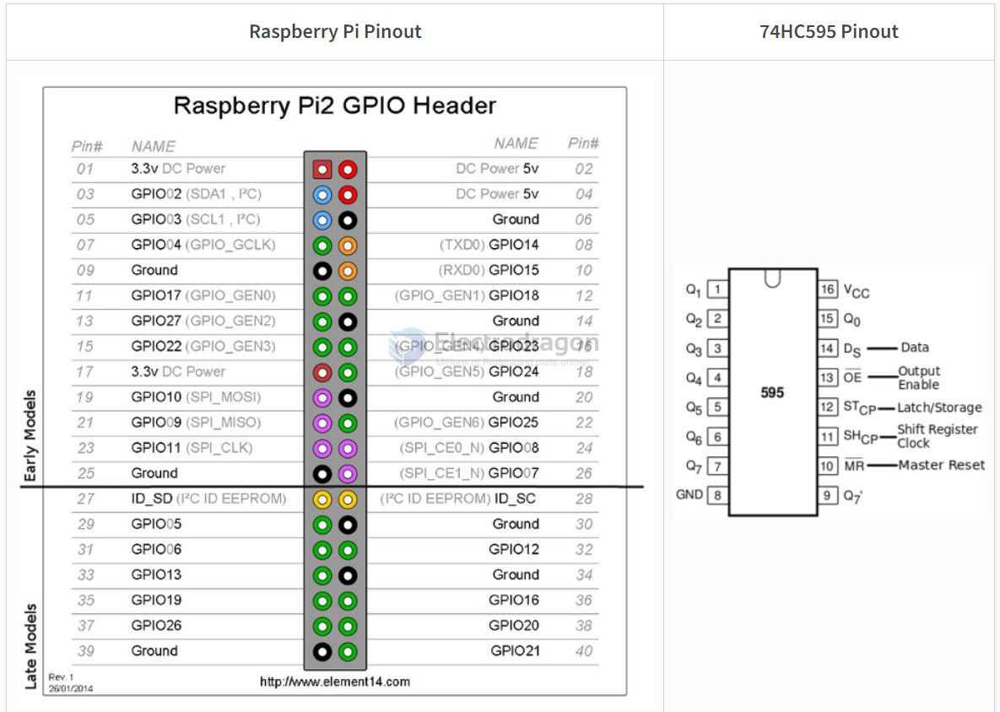

# 74HC595-dat

- SIPO = 74HC595 = 0.035 - Nexperia(安世) 封装: SOIC-16

- SNx4HC595 8-Bit Shift Registers With 3-State Output Registers

## functions 

## Drive the 7-segment led display 

## run with RPI 

- library - https://pypi.org/project/pi74HC595/

install 

    pip install pi74HC595

## pin 

- DS - data 
- ST - latch
- SH - shifter register clock 

optional
- OE - output enable - default ground 
- When the output-enable (OE) input is high, the outputs are in the high-impedance state.

## ref 

- [[RPI-dat]]

- [[74HC595]]