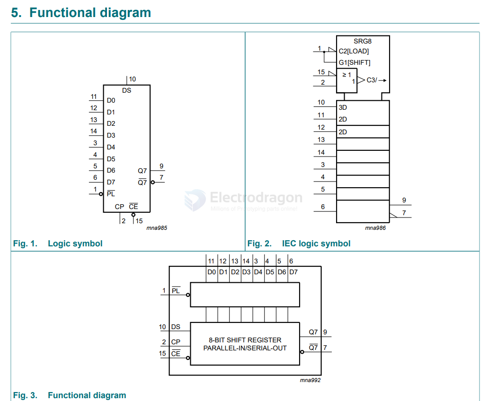

# 74xx-dat

- [[logic-dat]]

## 74ACT00-dat

- [[74ACT00-dat]] == Quad 2-Input NAND Gate

## 74xx04-dat

- [[74xx04-dat]] == Hex Inverter

## 74HC165D

- [[74hc595-dat]]

## inverter 

- [[74xx1G14-dat]] 

| chip             | gate                 | functions                 | and               |
| ---------------- | -------------------- | ------------------------- | ----------------- |
| [[74xx1G00-dat]] | NAND                 | buffering, Level Shifting |                   |
| [[74xx1G07-dat]] | non-inverting buffer |                           | OPEN DRAIN OUTPUT |
| [[74xx1G08-dat]] | AND                  |                           |                   |
| [[74xx1G14-dat]] | inverting buffer     |                           |                   |

## more chips 

- 74HC244 == Octal 3-State Noninverting Buffer/Line Driver/Line Receiver MC74HC244A, MC74HCT244A

- 74HC240

- [[74HC595]]

- [[74HCT245]]

- SMD SN74HC74DR SOIC-14 Dual D-type positive-edge triggered flip-flop logic chip

- Dual 4-channel analog multiplexer/demultiplexer - 74HC4052D,653 SOIC-16 dual 4-channel analog multiplexer chip

- 74HC164D,653 SOIC-14 8-bit serial-in/parallel-out shift register

- 8-bit parallel-in/serial-out shift register - 74HC165D,653 SOIC-16 8-bit parallel or serial input / shift register

- 74HC14D,653 SOIC-14 Hex inverting Schmitt trigger logic chip

- 74HC151D,653 SOIC-16 8-input multiplexer SMD logic chip - 8-input multiplexer

- SMD SN74HC157DR SOIC-16 Data selector / multiplexer chip
  
- 74HC04D,653 SOIC-14 Hex inverter SMD logic chip

- 74HC4040D 74HC4040 SMD SOP-16 counter — brand new imported

- 74HC4060D SOIC-16 Oscillator with 14-stage binary ripple counter

- 74HC4051PW,118 TSSOP-16 8-channel analog multiplexer/demultiplexer

- Brand new original CD74HC4052M96 SOIC-16 single-channel analog multiplexer chip

- 74HC573PW,118 TSSOP-20 Octal D-type transparent latch; 3-state outputs
- Through-hole SN74HC573AN DIP-20 Eight-bit 3-state output latch logic chip

- 74HC125D,653 SOIC-14 Quad buffer / line driver with 3-state outputs

- 74HC138D,653 SOIC-16 3-to-8 line decoder / demultiplexer; inverting

- Through-hole SN74HC74N DIP-14 Dual D flip-flop with set and reset, positive-edge triggered

- SN74HC574NSR SOIC-20 Octal edge-triggered D-type flip-flop with 3-state outputs

- Brand new imported 74HC590AP 74HC590 DIP16 8-bit binary counter chip - 74HC590D 8-bit counter and output register SOP16 M74HC590RM13TR brand new
- 8-bit binary counter with output register; 3-state

- TI's SN54LS592 is an 8-Bit Binary Counter With Input Registers.
  
- Original imported 74HC393D 74HC393 Narrow-body SMD SOP-14 Dual 4-bit binary ripple counter

- Original SN74LS90N DIP14 Decimal counter / divide-by-2/5 counter through-hole IC

## CD 

- CD4094B - 8 Bit Shift Register w/ 3 State Output - 8-Stage Shift-and-Store Bus Register

- Saibao original CD4518BE Binary/Decimal synchronous up/down counter DIP-16 Saibao

- Original through-hole CD4060BE DIP-16 Binary counter/divider — consists of an oscillator section and 14 ripple-carry binary counter stages.

- Brand new original CD4017BE Decimal counter chip through-hole DIP16

- (2pcs) Through-hole 74HC161 DIP-16 Synchronous 4-bit binary counter chip SN74HC161N

- Brand new imported CD40192 CD40192BE DIP-16 Synchronous up/down counter through-hole

- Brand new original CD4510 CD4510BE DIP-16 Counter logic IC

## other 

- MC14553BCP MC14553 counter chip

## ref 

- [[chip-dat]]