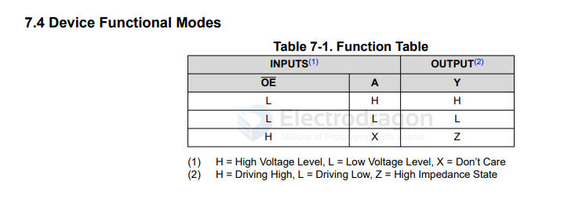
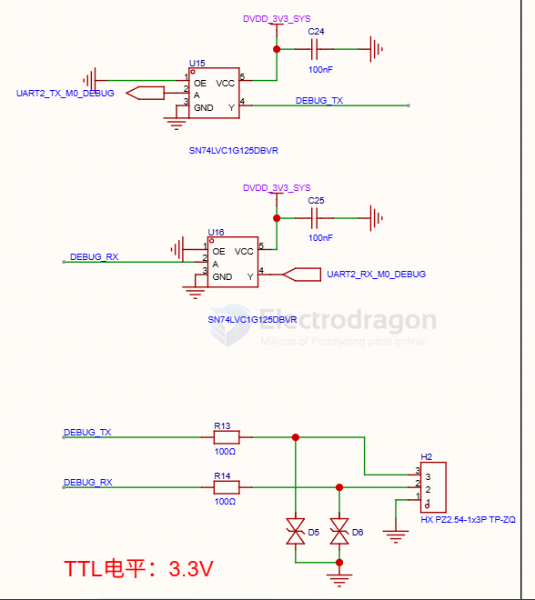

# 74xx125-dat

- [[logic-level-shifter-dat]] - [[74xx-dat]] - [[74xx125-dat]]

**74AHC1G125** – Single Bus Buffer Gate with **3-State Output**

- [[74xx1G125-dat]] - [[74xx-dat]] - [[74HC125-dat]]

## function diagram 

## build 

build 1 - use with a debugging board 

## ref 

