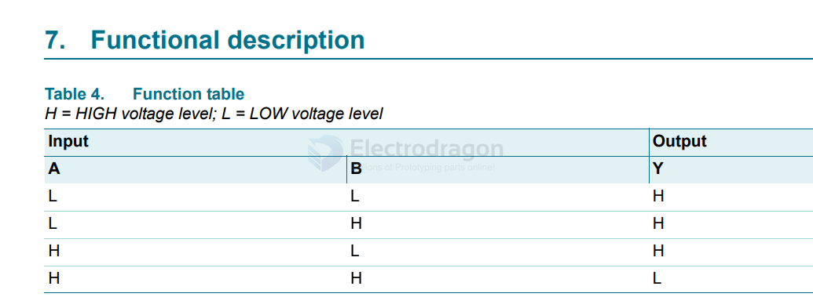

# 74xx1G07-dat

The 74LVC1G00 is a single 2-input NAND gate from the 74LVC family of high-speed CMOS logic devices. It is widely used in digital systems for its compact design, low power consumption, and versatile operation.

## Key Features:

1. 2-Input NAND Gate:

Performs the NAND (NOT AND) logic operation:

    Output = NOT (A AND B)

The output is LOW only when both inputs are HIGH.

2. High-Speed Operation:

Supports high-frequency operation with fast propagation delay, typical for modern CMOS technology.

3. Wide Voltage Range:

Operates from 1.65V to 5.5V, making it suitable for both low-voltage and standard-voltage digital systems.

4. Low Power Consumption:

Consumes minimal static and dynamic power, ideal for battery-operated devices.

5. Compact Package:

Available in small packages like SOT-23-5, SC-70, or DFN, suitable for space-constrained designs.

6. Overvoltage Tolerance:

Inputs are 5V tolerant, meaning they can handle 5V signals even when operating at lower supply voltages.

7. Schmitt-Trigger Inputs:

Provides noise immunity and clean switching behavior for slow or noisy input signals.

## Functions and Applications:

Logic Operations:

Used to implement NAND logic, a fundamental building block in digital electronics.

Signal Conditioning:

Cleans up noisy input signals and ensures clean digital transitions.

Universal Logic:

The NAND gate is universal; it can be combined to form any other logic gate (AND, OR, NOT, etc.).

Level Shifting:

Can act as a simple level shifter for low-to-high voltage interfacing, depending on the circuit design.

Clock and Control Logic:

Used in control circuits, clock generation, and synchronization.