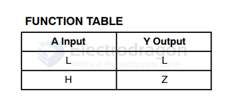

# 74xx1G07-dat

The 74HC1G07 is a single buffer with an open-drain output, part of the 74HC family of high-speed CMOS logic devices. It is used in various digital applications requiring buffering and interfacing.

https://www.onsemi.com/download/data-sheet/pdf/mc74vhc1g07-d.pdf

## Key Features:

Open-Drain Output:

The open-drain output requires an external pull-up resistor to operate.

It allows the output to pull the signal to low (0) but cannot actively drive it to high (1). Instead, the external resistor pulls it to the high level.

High-Speed Operation:

Operates at high frequencies typical of CMOS technology.

Wide Voltage Range:

Functions over a voltage range of 2.0V to 5.5V, making it suitable for mixed-voltage systems.

High Drive Capability:

Can sink relatively large currents, useful for driving LEDs or other loads.

Input Compatibility:

Inputs are TTL-compatible, meaning it works well in systems interfacing with older logic standards.

Compact Package:

Available in small form-factor packages like SOT-23-5 and SC-70, ideal for compact designs.

Low Power Consumption:

Consumes minimal power when idle, an advantage of CMOS technology.

## Functions and Applications:

Buffering:

Buffers signals to increase driving strength for long lines or multiple loads.

Level Shifting:

With appropriate pull-up resistors, it can be used to interface between devices operating at different voltage levels.

Wired-AND Logic:

Open-drain outputs allow multiple 74HC1G07 devices to share a single pull-up resistor, enabling wired-AND logic without additional components.

Driving LEDs or Relays:

The device can drive LEDs, relays, or other components that require higher current.

Interfacing:

Useful for interfacing microcontrollers or other digital circuits with external devices.