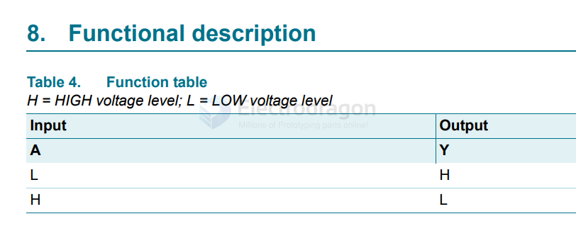

# 74xx1G14-dat

The MC74VHC1G14DFT1G is a single inverting Schmitt trigger manufactured by ON Semiconductor. It is part of the VHC (Very High-Speed CMOS) family and is designed for high-speed and low-power applications.

An inverting Schmitt trigger is a type of digital circuit that converts an input signal with noise or slow transitions into a clean, sharp digital output. It is "inverting" because the output signal is the logical opposite (inverted) of the input signal.

Inverting Operation:

The output is inverted compared to the input:
- When the input voltage exceeds the upper threshold, the output switches to LOW.
- When the input voltage drops below the lower threshold, the output switches to HIGH.

https://www.mouser.com/datasheet/2/916/74HC_HCT1G14-1385566.pdf?srsltid=AfmBOopmI2Sb0NtOkBFdYvsbVQHwVz-8gI-lhVkF_7wKB0Xu7qpUoi9H

- [[74xx-dat]]